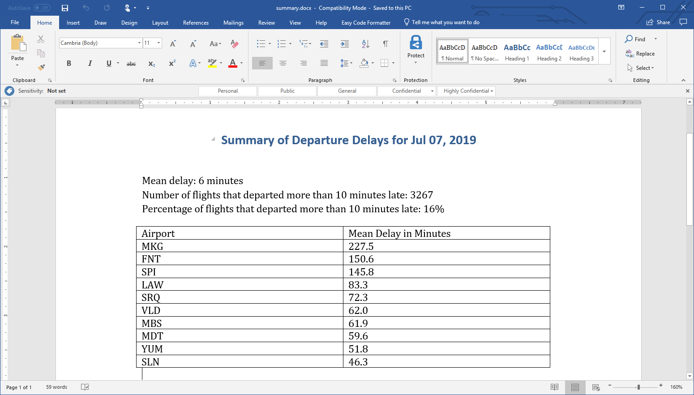

# Analyze data and summarize the results in Word
 
You work for an airline, and one of your daily tasks is creating a report summarizing the previous day's flight delays. Generating the report takes about 30 minutes. You first import the data into Microsoft Excel, and then pull key statistics such as the average departure delay and the percentage of flights that were delayed more than 10 minutes. Next, you copy-and-paste from Excel into a Microsoft Word document to produce a nicely formatted report that includes high-level KPIs and a table showing delays at individual airports.

It's not difficult, but it's unrelenting. It has to be done every day, and the manual nature of the process opens the door to error.

Being a technical person, you decide to automate the process. Python libraries such as [Pandas](https://pandas.pydata.org/) provide more than enough muscle for the analytical part. Other libraries such as [Python-docx](https://python-docx.readthedocs.io/en/latest/) offer rich APIs for creating Word documents. Let's marry the two to ingest airline data from a CSV file, analyze it, and produce a daily report summarizing the previous day's on-time performance.



## Analyze data with Pandas

Pandas, short for *Python Data Analysis Library*, is one of the world's most popular libraries for manipulating and analyzing data. The key data structure in Pandas is the [`DataFrame`](https://pandas.pydata.org/pandas-docs/stable/reference/api/pandas.DataFrame.html), which contains rows and columns like a database table and has methods for loading data from CSV files, filtering and sorting data, exporting to SQL, and more. In all, it contains more than 200 methods and attributes to simplify data handling and analysis.

1. Begin by executing the following commands in a Command Prompt window or terminal to install Pandas and Python-docx:

	```bash
	pip install pandas
	pip install python-docx
	```

1. Create a directory to serve as your project directory and `cd` into it. Then use this command to download a CSV file containing the latest information on flight delays:

	```bash
	curl https://topcs.blob.core.windows.net/public/flights.csv -o flights.csv
	```

	`curl` is a Linux command. It's also installed on Windows 10 build 1706 and higher. If you are running an older version of Windows, you can download `curl` from the [`curl` download page](https://curl.haxx.se/download.html), or you can download the CSV file directly from [here](https://topcs.blob.core.windows.net/public/flights.csv).

1. Take a moment to browse the contents of **flights.csv**. It contains a header row with column names, followed by more than 20,000 rows containing information about individual flights. The ORIGIN column identifies the airport that the flight originated from. DEP_DELAY indicates the number of minutes each flight was late in departing. A negative number means the flight left early.

1. Create a text file named **summarize_delays.py** and open it in your favorite text editor. You can use any text editor you'd like, but we recommend using [Visual Studio Code](https://code.visualstudio.com/) — Microsoft's free, lightweight source-code editor for Windows, macOS, and Linux that features IntelliSense, integrated Git support, and more.

1. Paste the following code into **summarize_delays.py**, and then save the file:

	```python
	import pandas as pd
	
	df = pd.read_csv('flights.csv')
	mean_delay = df['DEP_DELAY'].mean()
	delayed_10 = len(df[df['DEP_DELAY'] > 10])
	percent_10 = percent = len(df[df['DEP_DELAY'] > 10]) / df.shape[0]
	mean_by_airport = df.groupby('ORIGIN')['DEP_DELAY'].mean().sort_values(ascending=False).head(10)

	print('Mean delay: {0:.0f} minutes'.format(mean_delay))
	print('Number of flights that departed more than 10 minutes late: {}'.format(delayed_10))
	print('Percentage of flights that departed more than 10 minutes late: {0:.0%}'.format(percent_10))
	print('Mean delays for individual airports:\n')
	print(mean_by_airport)
	```

	This code uses `DataFrame`'s [`read_csv()`](https://pandas.pydata.org/pandas-docs/stable/reference/api/pandas.read_csv.html) method to read flight information from the CSV. Then it uses other `DataFrame` methods to compute the average delay for all flights, the number and percentage of flights that departed more than 10 minutes late, and the average delay time for each airport. Finally, it outputs the results to the screen.

1. Use the following command to execute **summarize_delays.py**:

	```bash
	python summarize_delays.py
	```

1. Confirm that the output looks like this:

	```
	Mean delay: 6 minutes
	Number of flights that departed more than 10 minutes late: 3267
	Percentage of flights that departed more than 10 minutes late: 16%
	Mean delays for individual airports:

	ORIGIN
	MKG    227.500000
	FNT    150.583333
	SPI    145.800000
	LAW     83.333333
	SRQ     72.312500
	VLD     62.000000
	MBS     61.857143
	MDT     59.647059
	YUM     51.750000
	SLN     46.333333
	Name: DEP_DELAY, dtype: float64
	```

In this example, the data source is a single CSV file. Pandas includes methods for loading data from SQL databases and other sources *and* for combining them into a single `DataFrame`, so your code could easily be modified to aggregate data from a variety of data sources.

## Generate a Word document with Python-docx

You're halfway to the finish line. Pandas makes short work of the analytical work. Python-docx does the same for reading and writing Word documents. It implements a rich yet intuitive API for generating and consuming **.docx** files. The [Python-docx home page](https://python-docx.readthedocs.io/en/latest/) contains a great quickstart to familiarize you with the basics.

1. Open **summarize_delays.py** and insert the following statements at the top of the file:

	```python
	import docx
	from docx.enum.text import WD_ALIGN_PARAGRAPH
	import datetime
	```

1. Add these statements to the bottom of the file, and then save your changes:

	```python
	doc = docx.Document()
	p = doc.add_heading('Summary of Departure Delays for {:%b %d, %Y}'.format(datetime.date.today()))
	p.alignment = WD_ALIGN_PARAGRAPH.CENTER
	doc.add_paragraph()
	p = doc.add_paragraph('Mean delay: {0:.0f} minutes'.format(mean_delay))
	p.paragraph_format.space_after = 0
	p = doc.add_paragraph('Number of flights that departed more than 10 minutes late: {}'.format(delayed_10))
	p.paragraph_format.space_after = 0
	doc.add_paragraph('Percentage of flights that departed more than 10 minutes late: {0:.0%}'.format(percent_10))

	table = doc.add_table(rows=1, cols=2, style='Table Grid')
	table.rows[0].cells[0].text = 'Airport'
	table.rows[0].cells[1].text = 'Mean Delay in Minutes'

	for name in mean_by_airport.index:
		row = table.add_row()
		row.cells[0].text = name
		row.cells[1].text = '{:.1f}'.format(mean_by_airport.loc[name])

	doc.save('summary.docx')
	```

	This code uses Python-docx to create a Word document, insert content, and save the document. The content consists of a heading, paragraphs listing basic statistics such as the average departure delay for all the flights in the dataset, and a table listing average delays at the 10 worst-performing airports. Key Python-docx methods used in the code include [`add_paragraph()`](https://python-docx.readthedocs.io/en/latest/api/document.html#docx.document.Document.add_paragraph), [`add_table()`](https://python-docx.readthedocs.io/en/latest/api/document.html#docx.document.Document.add_table), and [`add_row()`](https://python-docx.readthedocs.io/en/latest/api/table.html#docx.table.Table.add_row).

1. Use the following command to execute **summarize_delays.py** again:

	```bash
	python summarize_delays.py
	```

1. Confirm that the project directory now contains a file named **summary.docx**. Open the file in Microsoft Word. What do you see inside?

This example merely scratches the surface of what you can accomplish with Python-docx. Virtually anything that can be done in Microsoft Word can be done with Python-docx, too. Refer to [API Documentation](https://python-docx.readthedocs.io/en/latest/#api-documentation) for a comprehensive look at the Python-docx API.
