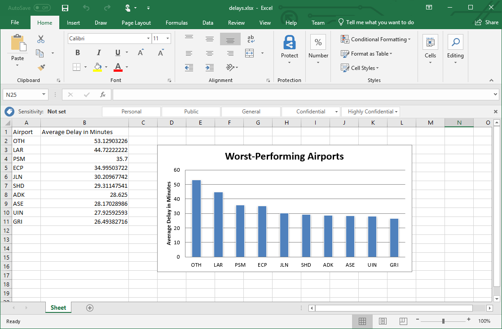

# Analyze data and create an Excel spreadsheet

The program that you wrote in the previous lesson to analyze flight delays and produce a Word document summarizing the results went over well and is adding time back onto your calendar every day. But your manager wants more. She wants a spreadsheet to complement the Word document. The spreadsheet should document the airports that incurred the worst average departure delays, and it should include a chart depicting those delays.

[Python-docx](https://python-docx.readthedocs.io/en/latest/) enables Python apps to produce Word documents. [OpenPyXL](https://openpyxl.readthedocs.io/en/stable/) is to Excel as Python-docx is to Word: It lets you create Excel spreadsheets, read Excel spreadsheets, and more. More importantly, it supports virtually all of the features of Excel, including the ability to produce charts and graphs.

Let's build on the previous lesson by using [Pandas](https://pandas.pydata.org/) to analyze flight delays and OpenPyXL to create an XLSX file.

## Analyze data with Pandas

You already know that Pandas is a popular Python library for manipulating and analyzing data. You used it in the previous lesson to load a CSV file containing information about flight delays and extract key metrics from the data. Let's use it again to produce a list of the 10 worst-performing airports.

1. Begin by executing the following commands in a Command Prompt window or terminal to install Pandas and Python-docx:

	```bash
	pip install pandas
	pip install openpyxl
	```

    If you installled Pandas in the previous lesson, you don't have to install it again. But it's important to install OpenPyXL because you will use it in the next exercise.

1. Create a directory to serve as your project directory and `cd` into it. Then use this command to download a CSV file containing the latest information on flight delays:

	```bash
	curl https://topcs.blob.core.windows.net/public/flights.csv -o flights.csv
	```

	`curl` is a Linux command. It's also installed on Windows 10 build 1706 and higher. If you are running an older version of Windows, you can download `curl` from the [`curl` download page](https://curl.haxx.se/download.html), or you can download the CSV file directly from [here](https://topcs.blob.core.windows.net/public/flights.csv).

1. Take a moment to browse the contents of **flights.csv**. It contains a header row with column names, followed by more than 20,000 rows containing information about individual flights. The ORIGIN column identifies the airport that the flight originated from. DEP_DELAY indicates the number of minutes each flight was late in departing. A negative number means the flight left early.

1. Create a text file named **chart_delays.py** and open it in your favorite text editor. Then paste in the following code and save the file:

	```python
	import pandas as pd
	
	df = pd.read_csv('flights.csv')
    mean_by_airport = df.groupby('ORIGIN')['DEP_DELAY'].mean().sort_values(ascending=False).head(10)
	print(mean_by_airport)
	```

 	This code uses `DataFrame`'s [`read_csv()`](https://pandas.pydata.org/pandas-docs/stable/reference/api/pandas.read_csv.html) method to read flight information from the CSV. Then it uses [`groupby()`](https://pandas.pydata.org/pandas-docs/stable/reference/api/pandas.DataFrame.groupby.html) to group rows by originating airport, [`mean()`](https://pandas.pydata.org/pandas-docs/stable/reference/api/pandas.DataFrame.mean.html) to compute the mean departure delay for each airport, [`sort_values()`](https://pandas.pydata.org/pandas-docs/stable/reference/api/pandas.DataFrame.sort_values.html) to sort from largest to smallest, and [`head()`](https://pandas.pydata.org/pandas-docs/stable/reference/api/pandas.DataFrame.head.html) to extract the top 10 rows. Finally, it outputs the results to the screen.

1. Use the following command to execute **chart_delays.py**:

	```bash
	python chart_delays.py
	```

1. Confirm that the output looks like this:

	```
    ORIGIN
    MKG    227.500000
    FNT    150.583333
    SPI    145.800000
    LAW     83.333333
    SRQ     72.312500
    VLD     62.000000
    MBS     61.857143
    MDT     59.647059
    YUM     51.750000
    SLN     46.333333
    Name: DEP_DELAY, dtype: float64
	```

As in the previous lesson, the data source is a single CSV file. Recall that Pandas includes methods for loading data from SQL databases and other sources *and* for combining them into a single `DataFrame`, so your code could easily be modified to aggregate data from a variety of data sources.

## Generate an Excel spreadsheet with OpenPyXL

Now it's time to work some magic with OpenPyXL. The first step is to to create a spreadsheet and inject rows and columns listing the mean delays at the airports in `mean_by_airport`. The second is to create a bar chart from the data.

1. Open **chart_delays.py** and insert the following statements at the top of the file:

	```python
    from openpyxl import Workbook
    from openpyxl.chart import BarChart, Reference
	```

1. Add these statements to the bottom of the file, and then save your changes:

	```python
    workbook = Workbook()
    worksheet = workbook.active
    worksheet.append(['Airport', 'Average Delay in Minutes'])

    for name, val in mean_by_airport.items():
        worksheet.append([name, val])

    chart = BarChart()
    chart.type = "col"
    chart.style = 10
    chart.title = "Longest Departure Delays"
    data = Reference(worksheet, min_col=2, min_row=1, max_row=11)
    categories = Reference(worksheet, min_col=1, min_row=2, max_row=11)
    chart.add_data(data, titles_from_data=True)
    chart.set_categories(categories)
    chart.y_axis.title = 'Average Delay in Minutes'
    chart.legend = None
    chart.shape = 8
    worksheet.add_chart(chart, "D3")

    worksheet.column_dimensions['B'].width = 28
    workbook.save('delays.xlsx')
	```

    This code begins by creating a `Workbook` object, getting a reference to the active worksheet, and adding rows to the worksheet. The first cell in each row contains an airport code; the second contains the average departure delay for flights originating from that airport. It then creates a `BarChart` object and adds it to the worksheet. The `BarChart` object gets it data from the rows and columns added previously.

1. Use the following command to execute **chart_delays.py** again:

	```bash
	python chart_delays.py
	```

1. Confirm that the project directory now contains a file named **delays.xslx**. Open the file in Microsoft Excel and confirm that it looks like this:

    

OpenPyXL gives you the ability to create spreadsheets on the fly. But what if you wanted to use Python to add entirely new capabilities to Excel? What if, for example, you wanted to use machine learning to make predictions from values in a spreadsheet? Funny you should ask, because that is the subject of the next lesson.