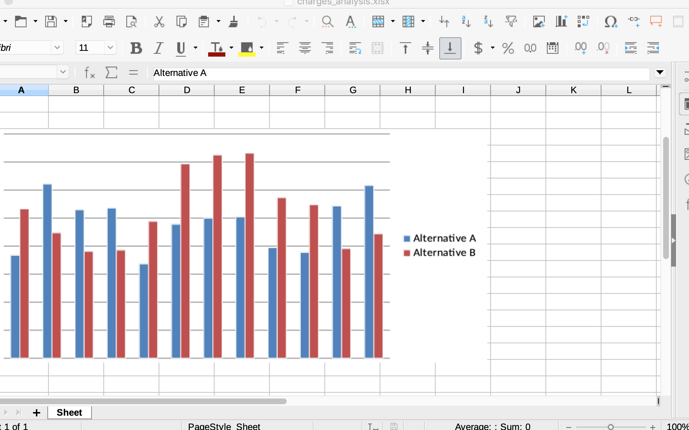

# How to read from and write to a Microsoft Excel document using **OpenPyXL**
 
You're responsible for an enormous, complicated spreadsheet.  You remember that you saw one particular cell in a peculiar color--was it purple?  Blue?  That particular value is suddenly important to you, but how are you going to find it?  Do you have to scan all tens of thousands of individual cells of each of the scores of sheets?

No:  there are easier ways.  In principle, [you can use Excel's built-in **Find** dialogue](https://excel.tips.net/T002396_Finding_Cells_Filled_with_a_Particular_Color.html), but it only knows to search for an exact color match.  You could [write a macro in VBA](https://www.thespreadsheetguru.com/the-code-vault/2014/11/5/retrieve-excel-cells-font-fill-rgb-color-code), but that presents its own problems.  Let's see how long it takes to solve this in Python ...


## Demonstration program

Install OpenPyXL:

    python -m pip install openpyxl

Create

     from openpyxl import load_workbook
     
     DEFAULT_COLOR = 1
     this_workbook = load_workbook(filename="Total Analysis.xlsx")
     for sheet in this_workbook:
         for column in range(1, 1 + len(list(sheet.columns))):
             for row in range(1, 1 + len(list(sheet.rows))):
                this_cell = sheet.cell(column=column, row=row)
                this_font = this_cell.font
                this_color = this_font.color.value
                if this_color != DEFAULT_COLOR:
                    print(f"On sheet {sheet.title}, cell "
                          f"{this_cell.column}{this_cell.row} "
                          f"has color {this_color}.")

If you have any appropriate `Total Analysis.xlsx` at hand, and you launch this program, you'll immediately see output that looks something like

        ...
    On sheet May 2018, cell J110 has color FF00B0F0.
    On sheet May 2018, cell J111 has color FF00B0F0.
    On sheet May 2018, cell M22 has color FF444444.
    On sheet June 2018, cell A27 has color FFFFFF00.
    On sheet June 2018, cell A32 has color 9.
    On sheet June 2018, cell A33 has color 9.
    On sheet June 2018, cell B8 has color FFFF0000.
    On sheet June 2018, cell B9 has color FFFF0000.
        ...

and so on.  While there is still a little work to do matching these color values to your memory of what you saw, you are close to a conclusive answer already.


## One-offs

Notice the peculiar nature of this program.  Generally people think of a computer program as something run many times--maybe thousands or millions of time.  The previous lesson, for instance, focused on an automation that would be useful every couple of weeks.

This small application is different.  It's only designed to be run once, just to help find a one-time result.  That's OK:  some programs are so small and quick to write, that it's faster to let the computer figure out a result for you one time, even including your effort to program the computer, than to undertake any alternative solution.  You can think of this as "experimental" programming.


## Excel diagrams for Python

The demonstration above showed Python reading from a spreadsheet.  The same **OpenPyXL** package also writes new spreadsheets, and updates existing ones.  **OpenPyXL**'s capabilities considerably exceed the limits of what [its documentation](https://openpyxl.readthedocs.io/en/stable/) only introduces, in fact.  **OpenPyXL** accesses essentially everything within Excel, although few of those capabilities have been written up as publicly-available working examples yet.

Suppose for a moment that you have Python programs that manage a large collection of data.  You want graphs of the results, but are unfamiliar with the [**matplotlib**](https://matplotlib.org) library others have told you the Python community widely uses.  No problem!  If you know Excel and _its_ plotting, **OpenPyXL** helps you marry the strengths of Python and Excel.  Prepare, reduce, and analyze your data with Python, then let Excel take over the graphing.  Here's a model:

1.  Create `chart.py` with content

    ```from openpyxl import Workbook
    from openpyxl.chart import BarChart, Reference


    def chart_data(worksheet):
        chart = BarChart()
        chart.type = "col"
        chart.style = 10
        chart.title = "Alternative monthly charges"
        data = Reference(worksheet, min_col=1, min_row=1, max_col=13, max_row=2)
        chart.add_data(data, titles_from_data=True, from_rows=True)
        chart.shape = 4
        worksheet.add_chart(chart, "A10")


    def load_data():
        (first, second) = retrieve_charges()
        workbook = Workbook()
        worksheet = workbook.active
        worksheet.append(["Alternative A"] + first)
        worksheet.append(["Alternative B"] + second)
        return workbook, worksheet

    def main():
        workbook, worksheet = load_data()
        chart_data(worksheet)
        workbook.save("charges_analysis.xlsx")


    def retrieve_charges():
        return [
            [73.41, 124.25, 105.88, 107.13, 67.27, 95.54, 99.89, 100.81, 78.92, 75.45, 108.63, 123.25],
            [106.56, 89.46, 76.23, 77.13, 97.65, 138.69, 144.99, 146.34, 114.57, 109.53, 78.21, 88.74]
        ]


    main()```

2.  Execute `python3 chart.py`.

3.  Notice that the program created `charges_analysis.xlsx`.

4.  When you open `charges_analysis.xlsx` inside Excel, you'll see a bar chart something like this within the spreadsheet:




## Further study

**OpenPyXL** co-operates well with the same **Pandas** library that appeared in the previous Lesson [TODO:  do we need a hyperlink here?].  A more realistic and complete application might analyze data with **Pandas**, then build a spreadsheet with **Panda**'s results.

**OpenPyXL** is not your only choice for bringing Python and Excel together.  Other Python packages, among which [**PyXLL**](https://www.pyxll.com/) is the most polished, are **add-ins** for Excel:  they communicate with an executing instance of Excel.  Excel can be used as a **dashboard**, for instance, with certain cells lighting up as alarms when a particular Python calculation yields a particular result.  Or the communication can go the other way:  Python can be used to drive a Web site, as "[Building an AI Web App with Flask and Python](https://github.com/Wintellect/MSLearn/tree/master/Building%20an%20AI%20Web%20App%20with%20Flask%20and%20Python)" [TODO:  Jeff, what is the public URL for this module?] introduces, with its content coming in real time from an Excel spreadsheet.  The next Lesson [TODO:  do we need a hyperlink here?] shows a small example of the rich additional communication possible between Excel and Python through Excel's **user-defined functions** (UDFs).


## Summary

* Several freely-available packages give Python the ability to read and write Excel spreadsheets.
* Among these, OpenPyXL is well-maintained and highly capable.
* A small Python program of only a dozen line can achieve impressive results in automatically retrieving and processing information from an Excel spreadsheet.
* Python is so productive that it's often worthwhile to write a Python program to solve a one-time need.
