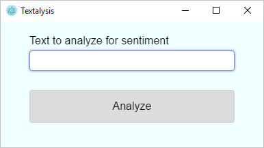

# Introduction

Imagine that you're a software developer at an Internet vacation-rentals firm and the company's communications department has asked you to write code that lets them analyze text for sentiment. The idea is that if sentiment towards the company turns negative on social media, communications can get out in front of it.

You had a class in college on machine learning and know the basics of Python and [Scikit-learn](https://scikit-learn.org/stable/index.html). But yours is not a Python shop. If you use Python to build a machine-learning model that scores text for sentiment, you'll need to wrap it so it can be called from other languages. [Containers](https://www.docker.com/what-container) seem like a great fit because you plan to deploy the model to the cloud where it can be accessed using REST APIs, and Azure offers a prebuilt container stack that is easy to use and 100% compatible with [Docker](http://www.docker.com). 

## Containers in Azure

Containers are similar to virtual machines (VMs) in that they provide a predictable and isolated environment in which software can run. Because containers are smaller than VMs, they start quickly and use less RAM. Moreover, multiple containers running on a single machine share the same operating system kernel. Docker is the world's most popular containerization platform. It is based on open standards, enabling Docker containers to run on all major Linux distributions as well as on Windows Server 2016.

To support running containerized applications in the cloud, Azure offers [Azure Container Instances](https://azure.microsoft.com/services/container-instances/), which provide a robust, scalable, and easy-to-use environment for hosting containerized applications, as well as the [Azure Container Registry](https://azure.microsoft.com/services/container-registry/). The latter allows container images to be hosted in Azure rather than in external repositories such as [Docker Hub](https://hub.docker.com/) and loaded quickly into Azure Container Instances. It also lets you restrict access to container images using [Azure Active Directory](https://azure.microsoft.com/services/active-directory/) (AAD), and use geo-replication to simplify deployment and operation. 

In this module, you will get first-hand experience with Azure Container Instances and the Azure Container Registry and learn about building and operationalizing machine-learning models at the same time. You will begin by using [Scikit-learn](https://scikit-learn.org/stable/index.html) to build and train a machine-learning model that scores text for sentiment. You will then use the [Azure Cloud Shell](https://azure.microsoft.com/features/cloud-shell/) to build a Docker image containing a [Flask](http://flask.pocoo.org/) Web server that exposes the model using a REST endpoint, and deploy the image to an Azure Container Registry. Finally, you will run the Docker image in an Azure Container Instance and use the cross-platform app pictured below to score the text that you type for sentiment on a scale of 0.0 (negative) to 1.0 (positive) by invoking the machine-learning model in the container.

## Learning objectives

Here's a preview of the skills you will acquire in this module:

- How to run Python code in [Azure Notebooks](https://notebooks.azure.com)
- How to build, train, and serialize machine-learning models using Scikit-learn
- How to load a serialized machine-learning model and use it in a Python app
- How to create an Azure Container Registry
- How to build a Docker image and deploy it using the Azure Cloud Shell
- How to run a containerized app in an Azure Container Instance
- How to use Flask to expose REST APIs from a container
- How to call REST APIs from apps written in [Node.js](https://nodejs.org/)

As you do, you will answer a question that is commonly asked by enterprise developers: If I build a machine-learning model in Python, how do I operationalize it in such a way that I can call it from apps written in other languages?