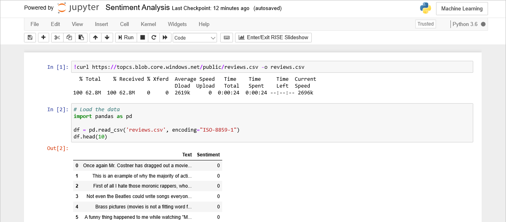
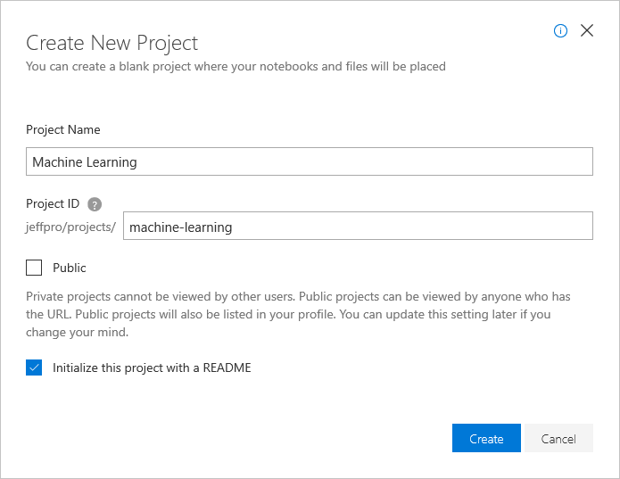
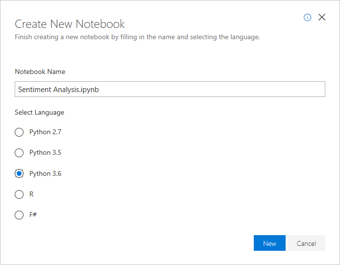
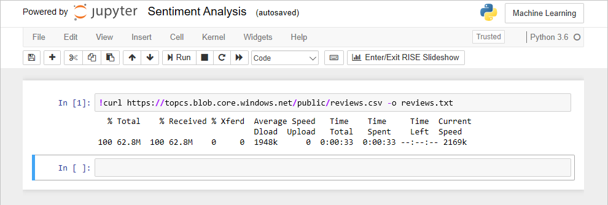
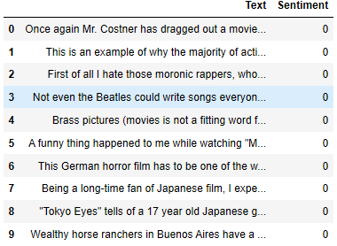
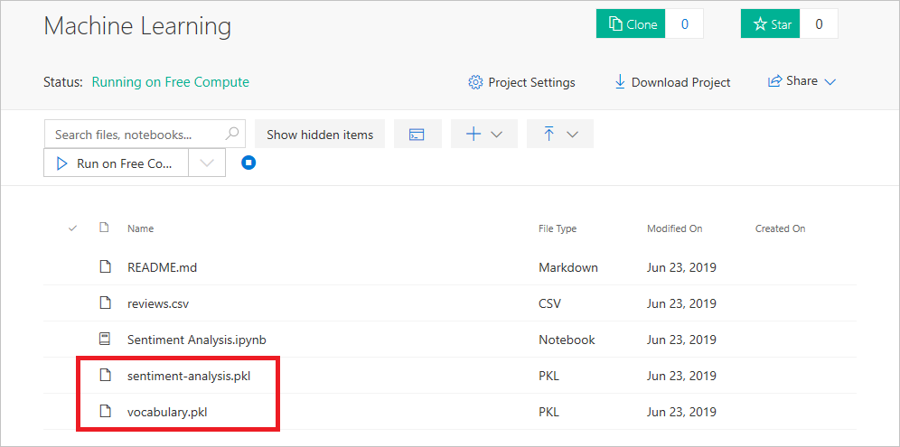

# Build and train a machine-learning model

The first order of business is to create a machine-learning model that can examine a string of text and assign it a score from 0.0 to 1.0 quantifying the sentiment expressed therein. Ten years ago, this would have been a Herculean task. Today, it's rather easy with [Scikit-learn](https://scikit-learn.org/stable/index.html).

Scikit-learn is the most popular library on the planet for building machine-learning models. It's free, it's open-source, and it's preloaded into [Azure Notebooks](https://notebooks.azure.com), which is a cloud-based platform for building and running [Jupyter notebooks](http://jupyter.org/).  Jupyter is an environment based on [IPython](https://ipython.org/) that facilitates interactive programming and data analysis using a variety of programming languages, including Python. Jupyter notebooks enjoy widespread use in research and academia for mathematical modeling, machine learning, and statistical analysis. Azure Notebooks provide Jupyter as a service for free. It's a convenient way to build notebooks and share them with others without having to install and manage a Jupyter server. And it's completely Web-based, making it an ideal solution for collaborating online.



In this lesson, you will create an Azure notebook and use Scikit-learn to build a sentiment-analysis model. Then you will save the model and download a pair of files that enable the model to be loaded and used by other applications.

## Create an Azure notebook

Azure notebooks are created through the portal at https://notebooks.azure.com and require nothing more than a browser and a [Microsoft account](https://account.microsoft.com/account). Notebooks are contained in projects, whose primary purpose is to group related notebooks. In this exercise, you will create a new project and then create a notebook inside it.

1. Navigate to https://notebooks.azure.com in your browser and sign in using your Microsoft account. Click **My Projects** in the menu at the top of the page. Then click the **+ New Project** button at the top of the "My Projects" page.

1. Create a new project named "Machine Learning." Check the "Public" box if you'd like to share notebooks with other people later on. You can also go into project settings once a project is created and change its visibility to public or private. 

	

	_Creating a project_
 

1. Click **+ New** and select **Notebook** from the menu to add a notebook to the project.

	

	_Adding a notebook to the project_

1. Name the notebook "Sentiment Analysis.ipynb," and select **Python 3.6** as the language. This will create a notebook with a Python 3.6 kernel for executing Python code. One of the strengths of Azure notebooks is that you can use different languages by choosing different kernels.

	

	_Creating a notebook_

	If you're curious, the **.ipynb** file-name extension stands for "IPython notebook." Jupyter notebooks were originally known as IPython (Interactive Python) notebooks, and they only supported Python as a programming language. The name Jupyter is a combination of Julia, Python, and R — the core programming languages that Jupyter supports.

1. Click the notebook to open it for editing.

You can create additional projects and notebooks as you work with Azure Notebooks. You can create notebooks from scratch, or you can upload existing notebooks. And once a notebook is created or uploaded, you can take advantage of Azure compute resources to run the notebook and leverage popular Python libraries such as [Keras](https://keras.io/), [NumPy](http://www.numpy.org/), [Pandas](https://pandas.pydata.org/), [Matplotlib](https://matplotlib.org/), and [Scikit-learn](https://scikit-learn.org/stable/index.html).

## Build and train the model

In this exercise, you will load a dataset and use it to train a sentiment-analysis model.

1. Enter the following statement in the notebook's first cell and click the **Run** button in the notebook's toolbar to execute it:

	```bash
	!curl https://topcs.blob.core.windows.net/public/reviews.csv -o reviews.csv
	```

	This statement loads a 63 MB CSV file from Azure blob storage. Azure notebooks limit file uploads to 10 MB, but you can load larger datasets from external sources. `curl` is a Bash command that's familiar to Linux users. You can execute Bash commands in Azure notebooks by preceding them with exclamation points (!).

	

	_Loading the dataset_

1. Paste the following statements into the next cell and run the cell to load the dataset that was just copied from blob storage:

	```python
	# Load the data
	import pandas as pd
	
	df = pd.read_csv('reviews.csv', encoding="ISO-8859-1")
	df.head(10)
	```

	The `import` statement loads [Pandas](https://pandas.pydata.org/), a popular Python library for analyzing and manipulating data. The next statement reads the dataset from the CSV file, and the next one shows the first 10 rows:

	

	_Examining the dataset_

	The dataset contains 50,000 movie reviews from the popular [IMDB dataset](https://www.kaggle.com/iarunava/imdb-movie-reviews-dataset). The "Text" column contains the text of the reviews. The "Sentiment" column contains 0s and 1s indicating whether a review is negative (0) or positive (1). There are 25,000 negative reviews and 25,000 positive ones, forming a very balanced dataset. That's always a goal when training a binary-classification model.

1. Run the following statements in the next cell to clean the data by converting all the text to lowercase, removing punctuation symbols, and eliminating HTML artifacts:

	```python
	# Clean the data
	df['Text'] = df['Text'].str.lower()
	df['Text'] = df['Text'].str.replace("[.;:!\'?,\"()\[\]]", '')
	df['Text'] = df['Text'].str.replace("(<br\s*/><br\s*/>)|(\-)|(\/)", ' ')
	df.head(10)
	```

1. Now run this code to vectorize the text:

	```python
	# Vectorize the text
	from sklearn.feature_extraction.text import CountVectorizer
	
	vectorizer = CountVectorizer(ngram_range=(1, 2), stop_words=['the', 'and', 'am', 'are'], min_df=10)
	vectors = vectorizer.fit_transform(df['Text'])
	```

	Machine-learning models can't deal with text. They only work with numbers. Scikit-learn's [`CountVectorizer.fit_transform()`](https://scikit-learn.org/stable/modules/generated/sklearn.feature_extraction.text.CountVectorizer.html#sklearn.feature_extraction.text.CountVectorizer.fit_transform) function counts the words in the corpus of text passed to it and builds a dictionary of words ranked by frequency of occurrence. Then it produces vectors (arrays) containing the numeric indexes of individual words or *ngrams* (sequences of words such as "terrible service" or "helpful staff"). `ngram_range=(1, 2)` tells `CountVectorizer` to consider not just individual words, but combinations of up to two words. The `stop_words` parameter tells it to ignore common words such as "and" and "the." `min_df=10` tells it to ignore words and ngrams that occur less than 10 times and serves to reduce the memory footprint of the model while sacrificing little or no accuracy.

1. The next step is to build the model and train it with the vectorized text. Use this code to split the dataset into a training set and a test set, train a [logistic-regression](https://en.wikipedia.org/wiki/Logistic_regression) model with the training set, and evaluate the accuracy of the model with the test set:

	```python
	from sklearn.linear_model import LogisticRegression
	from sklearn.model_selection import train_test_split
	
	# Split the dataset into a training set and a test set
	x_train, x_test, y_train, y_test = train_test_split(vectors, df['Sentiment'], test_size=0.2, random_state=0)

	# Train a classifier
	model = LogisticRegression()
	model.fit(x_train, y_train)

	# Score the model
	model.score(x_test, y_test)
	```

	The `score()` method should report that the model is about 90% accurate in classifying sentiment, based on the results it obtained by comparing the scores in the test data to scores computed by the model.

1. Now that the model is trained, use the following code to test it by scoring a string of text for sentiment:

	```python
	review = ['The long lines and poor customer service really turned me off']
	model.predict_proba(vectorizer.transform(review))[0][1]
	```

	The second statement vectorizes the input text and passes it to the model's `predict_proba()` function, which returns a pair of floating-point values indicating the probability that the sentiment is negative and the probability that it is positive. It is the latter value that we use as the sentiment score. How does this text score for sentiment?

1. Try the model with this sample:

	```python
	review = ['Great service and some of the best sushi I have ever had']
	model.predict_proba(vectorizer.transform(review))[0][1]
	```

	Does this text score closer to 1.0?

Feel free to try it with text of your own. The model won't get it right all of the time, but it should get it right *most* of the time.

## Save the model

The final task is to serialize the model and download it from your Azure notebook so the same model can be used in other applications. Serialization is performed by calling [`pickle.dump()`](https://docs.python.org/3/library/pickle.html#pickle.dump) in Python's [pickle](https://docs.python.org/3/library/pickle.html) module. In this case, there are two entities that need to be serialized: the machine-learning model itself, and the dictionary (vocabulary) created by `CountVectorizer`. The latter can be accessed through `CountVectorizer`'s `vocabulary_` attribute.

1. Run the following code in the notebook to generate a pair of **.pkl** files containing the serialized model and vocabulary:

	```python
	# Save the model and the vocabulary
	import pickle
	
	pickle.dump(model, open('sentiment-analysis.pkl', 'wb'))
	pickle.dump(vectorizer.vocabulary_, open('vocabulary.pkl', 'wb'))
	```

1. Return to the "Machine Learning" project page in the Azure Notebooks portal. Refresh the page and download the two **.pkl** files by right-clicking them and selecting **Download** from the context menu. Store them in the location of your choice on your hard disk. You will need them in the next lesson.

	

	_Downloading the serialized model_

1. Return to the notebook and run the following code to find out what version of Scikit-learn the model was saved with:

	```python
	import sklearn
	sklearn.__version__
	```

	Write down the version number (for example, 0.20.3) because you will need it, too, in the next lesson. Generally speaking, a model saved with one version of Scikit-learn can't be loaded with another version. There are some exceptions, but if you make sure that the model is saved and loaded with the *same* version of Scikit-learn, versioning won't be an issue. 

1. Finish up by selecting **Save and Checkpoint** from the notebook's **File** menu in case you want to return to this notebook later.

The model is building is done. In the next lesson, you will write some Python code that uses the model and build that code into a Docker container image.