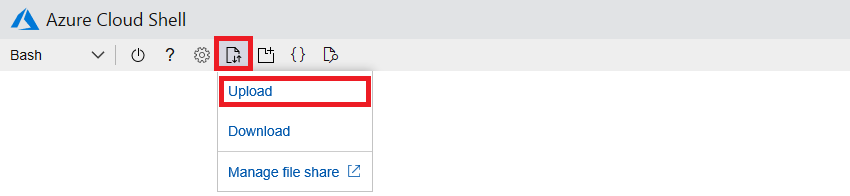

# Build a Docker image and deploy it to Azure

In order to run an app in a container, you must first "containerize" or "Dockerize" the app by placing it in a Docker container image. Then you deploy the image to a container registry and create a container from that image.

In this lesson, you will create an [Azure Container Registry](https://azure.microsoft.com/services/container-registry/) to host container images in Azure. You will write the containerized app and in it use Scikit-learn to load the machine-learning model you built in the previous lesson and [Flask](http://flask.pocoo.org/) to implement a REST endpoint for calling the model. Then you will use the [Azure Cloud Shell](https://azure.microsoft.com/features/cloud-shell/) to build a container image and push it to the Azure Container Registry.

## Deploy an Azure Container Registry

In this exercise, you will create your own Azure Container Registry, which acts as a repository for Docker images in much the same way that [Docker Hub](https://hub.docker.com/) does. But when you run containers in Azure, they start faster if the images that they load are hosted in Azure, too — especially if both reside in the same data center.

1. Open your browser and navigate to https://shell.azure.com to launch the Azure Cloud Shell. If you are asked to log in, do so using your Microsoft account.

1. Type the following command to list the Azure subscriptions associated with your Microsoft account:

	```bash
	az account list
	``` 

	The default subscription — the one used to create resources created with the Cloud Shell — is marked `isDefault=true`. If that's the subscription you wish to use, or if it's the only subscription in the list, proceed to the next step. Otherwise, use the following command to designate one of the other subscriptions as the default, replacing SUBSCRIPTION_ID with the ID of that subscription: 

	```bash
	az account set -s SUBSCRIPTION_ID
	```

	You can press **Shift+Ins** to paste the contents of the clipboard into the Cloud Shell if you are running Windows, or **Cmd+V** if you use a Mac. Similarly, you can use **Ctrl+C** to copy text to the clipboard from the Cloud Shell on Windows or **Cmd+C** on a Mac

1. Use the following command to create a resource group named "azure-ml-rg" to hold all the Azure resources you create in this module:

	```bash
	az group create --name azure-ml-rg --location northcentralus
	```

	Resource groups are an incredibly important feature of Azure. They act as containers for other Azure resources and serve to group those resources together so you can view billing information for them as a group, apply security rules as a group, and even delete them as a group. *Every* Azure resource that you create must be part of a resource group.

2. Execute the following command in the Cloud Shell to deploy an Azure Container Registry, replacing REGISTRY_NAME with the name you wish to assign your container registry. That name must be unique within Azure, so if the command fails because the name isn't unique, try again with another name: 

	```bash
	az acr create -g azure-ml-rg -n REGISTRY_NAME --admin-enabled true -l northcentralus --sku Basic
	```

	The reason you used the `--admin-enabled true` option is that doing so allows you to log in to the container registry using the registry name as the user name and an access key obtained from Azure as the password.

1. Use the following command to show the access keys for the container registry, replacing REGISTRY_NAME with the name of your container registry:

	```bash
	az acr credential show -n REGISTRY_NAME
	```

	Copy either of the access keys (passwords) — the long strings containing letters and numbers — in the output into a text editor so you can easily retrieve it later. Because you specified `--admin-enabled true` when creating the container registry, these access keys serve as passwords for logging into the registry. 

With the container registry deployed and an access key in hand, the next step is to create a Docker image and push it to the registry.

## Write an app and a Dockerfile

In this exercise, you will create a file named **app.py** containing the Python code that runs inside the container, and a file named **Dockerfile** containing Docker build instructions. You can use any text editor you'd like, but we recommend using [Visual Studio Code](https://code.visualstudio.com/) — Microsoft's free, lightweight source-code editor for Windows, macOS, and Linux that features IntelliSense, integrated Git support, and more.

1. Create a file named **app.py** in the same folder in which you saved **sentiment-analysis.pkl** and **vocabulary.pkl** in the previous lesson and insert the following Python code. Then save the file.

	```python
	import pickle, re
	from sklearn.feature_extraction.text import CountVectorizer
	from flask import Flask, request
	
	app = Flask(__name__)
	model = pickle.load(open('sentiment-analysis.pkl', 'rb'))
	vocab = pickle.load(open('vocabulary.pkl', 'rb'))
	
	vectorizer = CountVectorizer(ngram_range=(1, 2),
	    stop_words=['the', 'and', 'am', 'are'],
	    vocabulary=vocab)
	
	@app.route('/predict', methods=['GET'])
	def predict():
	    text = request.args.get('text')
	    text = re.sub("[.;:!\'?,\"()\[\]]", '', text.lower())
	    text = re.sub("(<br\s*/><br\s*/>)|(\-)|(\/)", ' ', text)
	    return str(model.predict_proba(vectorizer.transform([text]))[0][1])
	
	if __name__ == '__main__':
        app.run(debug=True, port=8008, host='0.0.0.0')
	```

	This file contains a Python script that uses [Flask](http://flask.pocoo.org/) to expose a REST method named ```predict``` that clients can call to analyze a string for sentiment. Calls to `pickle.load()` load the saved machine-learning model and the vocabulary with which it was trained. Text to be analyzed is passed in a query-string parameter named "text" and ultimately passed to the model's `predict_proba()` (short for "predict probability") method.

1. Create a file named **Dockerfile** (no file-name extension) in the same folder and insert the following commands:

	```docker
	FROM python:3.6.7-stretch
	RUN pip install flask numpy scipy pandas scikit-learn==SCIKIT_VERSION && \
	    mkdir /app
	COPY app.py /app
	COPY sentiment-analysis.pkl /app
	COPY vocabulary.pkl /app
	WORKDIR /app
	EXPOSE 8008
	ENTRYPOINT ["python"]
	CMD ["app.py"]
	```

	This file contains instructions for building a Docker image that includes **app.py**, **sentiment-analysis.pkl**, and **vocabulary.pkl**, and that launches **app.py** when the container starts. It also opens port 8008 to the container so the Flask server can listen for incoming requests on that port.

1. Replace SCIKIT_VERSION on line 2 of **Dockerfile** with the Scikit-learn version number (for example, 0.20.3) obtained at the end of the previous lesson. Then save the file.

The files you need to build the Docker image are in place. Now let's build it and push it to the Azure Container Registry.

## Build a Docker image

You can use the [Docker CLI](https://docs.docker.com/engine/reference/commandline/cli/) as well as a number of third-party tools to build Docker images and push them to an Azure Container Registry. However, most of these tools require you to install software on your PC or laptop. A faster and more seamless way to build Docker images and push them to an Azure Container Registry is to use the Azure Cloud Shell, which lets you build Docker images using [Azure CLI](https://docs.microsoft.com/cli/azure/?view=azure-cli-latest) commands in the browser. Commands such as [`az acr build`](https://docs.microsoft.com/cli/azure/acr?view=azure-cli-latest#az-acr-build) let you build a Docker image from a [Dockerfile](https://docs.docker.com/engine/reference/builder/) and push it to an Azure Container Registry in one simple step, and without having to externally authenticate with the container registry.

In this exercise, you will use the Cloud Shell to build a Docker image from the **Dockerfile** you created and push it to the container registry you deployed in the previous exercise.

1. Return to the Cloud Shell and click the **Upload/Download** button at the top of the page. Then select **Upload** from the menu.

	

	_Uploading files to the Cloud Shell_

1. Browse to the folder containing **app.py**, **Dockerfile**, and the two **.pkl** files. Then upload these files to the Cloud Shell. Note that some browsers might require you to upload one file at a time.

1. In the Cloud Shell, use the following command to build a Docker image using the assets uploaded to the Cloud Shell and push the image to your container registry, replacing REGISTRY_NAME with the name of that registry. **Be sure to include the period at the end of the command** so the build will use the files in the current directory:

	```bash
	az acr build --registry REGISTRY_NAME --image text-analytics-server .
	```

1. Wait for the `az acr build` command to complete. (It will probably take a minute or two.) Then use the following command to confirm that the container was built and pushed to the container registry:

	```bash
	az acr repository list -n REGISTRY_NAME	
	```

	As usual, replace REGISTRY_NAME with your container registry's name.

Another way to confirm that the Docker image was built and pushed to the container registry is to open the registry in the [Azure Portal](https://portal.azure.com) and click **Repositories** in the menu on the left side of the blade. You will see a list of images present in the registry, and the list should include the one named "text-analytics-server" that you just built.