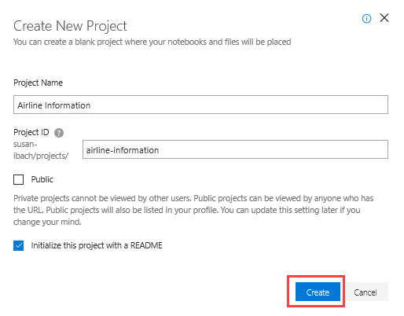
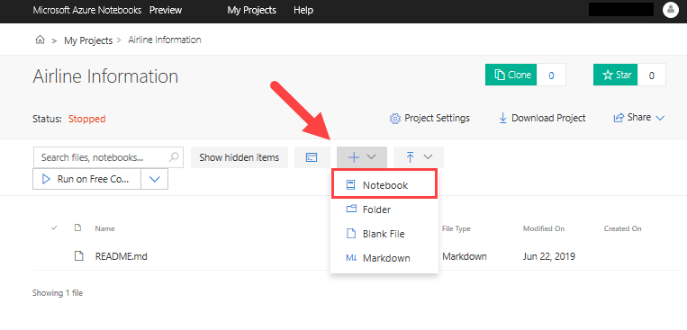
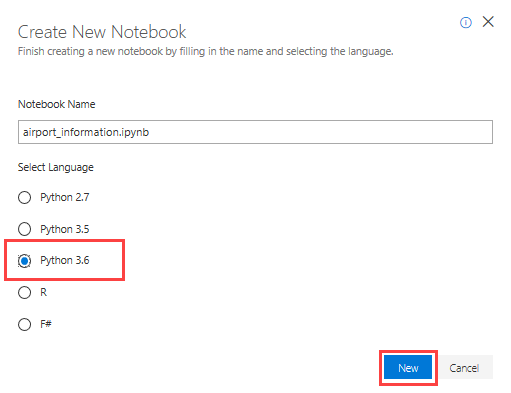
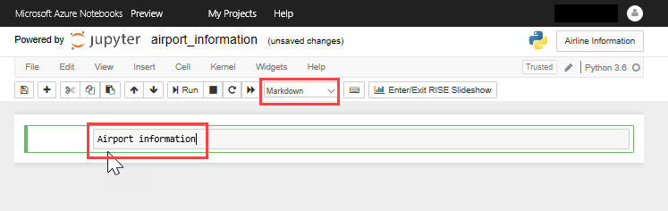
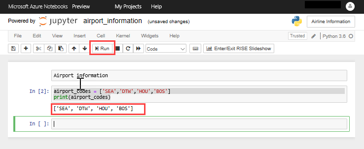

# Working with Notebooks

To try out your skills, you need to create a new Azure Notebook to run your Python code. Azure Notebooks are contained in libraries whose primary purpose is to group related notebooks. In this unit, you'll create a new project with a notebook and learn how to add and run Python code.

#Create an Azure Notebook
1. Navigate to https://notebooks.azure.com  in your browser.
2. Sign in using your Microsoft account.
3. Click My Projects in the top menubar.  
  
4. Click + **New Project**. Enter "Airline information" (without quotation marks) for the project name and "airline-information" as the project ID. Uncheck the **Public project** box, and select **Create**.  
   
5. Select the + sign to add a notebook to the project.  
   
Name the notebook "airport_information.ipynb" and select Python 3.6 Notebook as the language. This will create a notebook with a Python 3.6 kernel. One of the strengths of Jupyter notebooks is that you can use different languages by choosing different kernels.  
  
You can create additional projects and notebooks as you work with Azure Notebooks. Projects provide a means for grouping related notebooks. You can create notebooks from scratch, or upload existing notebooks. 

Select your notebook to open it.

## Writing code in your notebook
Jupyter notebooks are composed of cells. Each cell is assigned one of three types:  
- **Markdown** for entering text in markdown format.  
- **Code** for entering code that runs interactively.  
- **Raw NBConvert** for entering data inline.  

Code entered into code cells is executed by a kernel, which provides an isolated environment for the notebook to run in. 

1. In the first cell, set the cell type to **Markdown** and enter "Airport information" into the cell itself:  
  
2. Select the + button in the toolbar to add a new cell. Make sure the cell type is **Code**, and then enter the following Python code into the cell to create and print a list of airport codes:
```python
airport_codes = ['SEA','DTW','HOU','BOS']
print(airport_codes)
```
   
3. Now click the **Run** button to run the code cell. You will see the output of the print statement displayed beneath the code cell.  
 

Congratulations, you have created a notebook and executed Python code. You can use this notebook throughout the rest of the units to try out everything you learn. In the next lesson we will apply what we learned to read airport information from a csv (comma-separated variable) file and store it as a list.
