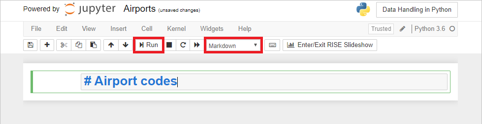
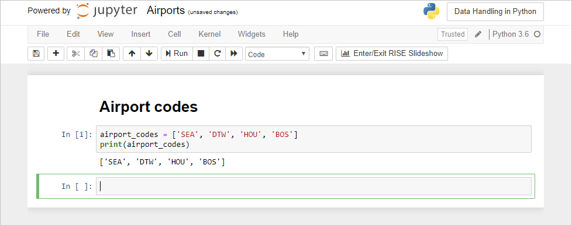

# Create an Azure notebook

In order to try your hand with Python and some of the libraries that make it a great language for analyzing and manipulating data, you need an environment in which to execute Python code. You could install Python on your computer. It's included in most Linux distributions, but if you're running Windows, chances are it has to be installed separately.

An alternative, and one widely used by Python porgrammers, is Jupyter notebooks. Jupyter is an environment based on [IPython](https://ipython.org/) that facilitates interactive programming and data analysis using a variety of programming languages, including Python. Jupyter notebooks enjoy widespread use in research and academia for mathematical modeling, machine learning, and statistical analysis. [Azure Notebooks](https//notebooks.azure.com) provide Jupyter as a service for free. It's a convenient way to build notebooks and share them with others without having to install and manage a Jupyter server. And it's completely Web-based, making it an ideal solution for collaborating online.


In this lesson, you will log into Azure Notebooks using your Microsoft account, create a project, and create your first notebook. In subsequent lessons, you will add additional notebooks to the project in order to get first-hand experience handling data in Python.

## Create a notebook

Azure notebooks are created through the portal at https://notebooks.azure.com and require nothing more than a browser and a [Microsoft account](https://account.microsoft.com/account). Notebooks are contained in projects, whose primary purpose is to group related notebooks. In this exercise, you will create a new project and then create a notebook inside it.

1. Navigate to https://notebooks.azure.com in your browser and sign in using your Microsoft account. Click **My Projects** in the menu at the top of the page. Then click the **+ New Project** button at the top of the "My Projects" page.

1. Create a new project named "Data Handling in Python." Check the "Public" box if you'd like to share notebooks with other people later on. You can also go into project settings once a project is created and change its visibility to public or private. 

	

	_Creating a project_

1. Click **+ New** and select **Notebook** from the menu to add a notebook to the project.

	

	_Adding a notebook to the project_

1. Name the notebook "Airports.ipynb," and select **Python 3.6** as the language. This will create a notebook with a Python 3.6 kernel for executing Python code. One of the strengths of Azure notebooks is that you can use different languages by choosing different kernels.

	

	_Creating a notebook_

	If you're curious, the **.ipynb** file-name extension stands for "IPython notebook." Jupyter notebooks were originally known as IPython (Interactive Python) notebooks, and they only supported Python as a programming language. The name Jupyter is a combination of Julia, Python, and R — the core programming languages that Jupyter supports.

1. Click the notebook to open it for editing.

You can create additional projects and notebooks as you work with Azure Notebooks. You can create notebooks from scratch, or you can upload existing notebooks. And once a notebook is created or uploaded, you can take advantage of Azure compute resources to run the notebook and leverage popular Python libraries such as [Keras](https://keras.io/), [NumPy](http://www.numpy.org/), [Pandas](https://pandas.pydata.org/), [Matplotlib](https://matplotlib.org/), and [Scikit-learn](https://scikit-learn.org/stable/index.html).

## Execute code in the notebook

Jupyter notebooks are composed of cells. Each cell is assigned one of three types: 
- **Markdown** for entering text in markdown format. 
- **Code** for entering code that runs interactively  
- **Raw NBConvert** for entering data inline

Code entered into code cells is executed by a *kernel*. The popular IPython kernel supports code written in Python, but dozens of other kernels are available supporting other languages. Azure notebooks (Jupyter notebooks created in Azure) support Python, R, and F#. They also support numerous packages and libraries that are commonly used in Python.

1. In the first cell, set the cell type to **Markdown** and type "# Airport codes" (without quotation marks) into the cell itself. The click the **Run** button in the notebook's toolbar:

	

	_Creating a markdown cell_

1. Type the following code into the next cell and click **Run** again to execute the code:

	```python
    airport_codes = ['SEA', 'DTW', 'HOU', 'BOS']
    print(airport_codes)
	```

	Confirm that a list of airport codes appears in the output:

	

	_Running a code cell_

You can add additional cells to the notebook as needed to execute code and document your work. Finish up by selecting **Save and Checkpoint** from the notebook's **File** menu to save the notebook. Get in the habit of saving early and often to minimize the chance of losing your work.  

---

## Analyzing flight information

Now you can start analyzing information on flight delays. The flight_delays.csv file contains information on past flights. You need to use this data to determine:

- The mean of the flight arrival delays 
- How many flights arrived more than 10 minutes late
- The longest delay for any flight
- Flight information for the flight with the longest delay

Open the file and examine the contents. Each row contains data for one flight. The ARR_DELAY column tells us in minutes how late a flight arrived:

- A negative number indicates the flight landed early 
- A zero indicates the flight landed on time
- A positive number indicated the flight was late

Let's start by importing the file and reading in the column headers. The file contains 99 rows. You can print out the length of the array to make sure all the rows were read successfully. You can also print the column names to make sure they are read in successfully:

```python
flight_data = genfromtxt('flight_delays.csv', delimiter=',', dtype=None, names=True, encoding=None)
print (flight_data.dtype.names) # outputs
# ('FL_DATE', 'OP_UNIQUE_CARRIER', 'TAIL_NUM', 'OP_CARRIER_FL_NUM', 'ORIGIN', 'DEST', 'CRS_DEP_TIME', 'DEP_TIME', 'DEP_DELAY', 'CRS_ARR_TIME', 'ARR_TIME', 'ARR_DELAY', 'CRS_ELAPSED_TIME', 'ACTUAL_ELAPSED_TIME', 'AIR_TIME', 'DISTANCE')
```
Now you can use the mean() function to determine the mean of the ARR_DELAY column for all flights: 

```python
print(flight_data['ARR_DELAY'].mean()) # outputs: 2.303030303030303
```

Getting the number of flights that were delayed more than 10 minutes will require using a comprehension that iterates across the array and filters rows based on the value in the ARR_DELAY column. You will put the results into a new array called delayed_flights. The number of rows in the delayed_flights array is the number of flights delayed more than 10 minutes:

```python
delayed_flights = [flight for flight in flight_data if flight['ARR_DELAY'] > 10]
print(len(delayed_flights)) # outputs: 15
```

To figure out the longest delay you need to retrieve the maximum value in the ARR_DELAY column:

```python
print(flight_data['ARR_DELAY'].max()) # outputs : 232
```

To get the flight information for the flight with the longest delay you need to use a comprehension that filters out the row with the maximum value for ARR_DELAY:

```python
biggest_delay = [flight for flight in flight_data if flight['ARR_DELAY'] == flight_data['ARR_DELAY'].max()]
print(biggest_delay) # outputs : 
# [('2018-10-01', 'WN', 'N435WN', 5757, 'ABQ', 'MCI', 1720, 2119, 239, 2005, 2357, 232, 105, 98, 87, 718)] #
```
Congratulations, you are starting to get a better understanding of how many flights are delayed and for how long. Let's continue analyzing flight data in our next lessons using pandas and matplotlib. 

