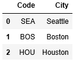

# Pandas

NumPy is great for loading data from CSV files and performing fast mathematical calculations on the data. But when it comes to cleaning, analyzing, and manipulating data, nothing beats [Pandas](https://pandas.pydata.org/). Pandas, short for *Python Data Analysis Library*, is the library that people who work with data for a living turn to for gathering insights from large datasets or preparing it for machine learning. It uses NumPy for speed and efficiency, and it goes far beyond NumPy in terms of the tools it offers for working with data. Like NumPy, Pandas is licensed under the [BSD license](https://github.com/pandas-dev/pandas/blob/master/LICENSE), enabling wide-ranging use with few restrictions.

The key data structure in Pandas is the [DataFrame](https://pandas.pydata.org/pandas-docs/stable/reference/api/pandas.DataFrame.html), which you can think of as a two-dimensional table of rows and columns with labeled axes. DataFrame includes methods for loading data from CSV files, filtering and sorting data, checking for and replacing missing values, removing rows and columns with missing values, joining DataFrames, rendering data on-screen, exporting to JSON, CSV, Excel, and SQL, and more. DataFrame contains more than 200 methods and attributes. A simple call to [`DataFrame.head()`](https://pandas.pydata.org/pandas-docs/stable/reference/api/pandas.DataFrame.head.html#pandas.DataFrame.head) in a Jupyter notebook gives you a look at the structure and content of the data:


Working with data is simpler when you have Pandas to lend a hand. In this lesson, you will learn the basics of Pandas.

## Working with DataFrames

A DataFrame is a two-dimensional data structure. Rows are indexed by number, and columns are indexed by name. You can create a DataFrame and initialize it with data using Pandas' [`DataFrame()`](https://pandas.pydata.org/pandas-docs/stable/reference/api/pandas.DataFrame.html) method:  

```python
import pandas as pd

column_names = ['Code', 'City']
data = [['SEA','Seattle'], ['BOS','Boston'], ['HOU','Houston']]
airports = pd.DataFrame(data, columns = column_names)
print(airports) # outputs : 
#   Code     City
# 0  SEA  Seattle
# 1  BOS   Boston
# 2  HOU  Houston
```

Use the [`loc`](https://pandas.pydata.org/pandas-docs/stable/reference/api/pandas.DataFrame.loc.html#pandas.DataFrame.loc) attribute to slice a DataFrame and create a new DataFrame containing a subset of the rows and columns of the original. The first parameter in square brackets specifies the range of rows, and the second parameter identifies the range of columns:

```python
print(airports.loc[0:1, 'Code':'City']) # outputs
#   Code     city
# 0  SEA  Seattle
# 1  BOS   Boston
```

You can also use `loc` to retrieve the contents of a specific row and column:

```python
print(airports.loc[0,'city']) # outputs : Seattle 
```

To retrieve a row (or range of rows), specify the beginning and ending row indexes in square brackets on the DataFrame itself. `[0:1]` retrieves the first row, `[0:2]` retrieves the first two rows, and so on:

```python
print(airports[0:1]) # outputs : 
#      airport_code     city
# 0             SEA  Seattle
```

And to retrieve a column, specify the column name:

```python
print(airports['Code'])
# outputs a Series 
# 0    SEA
# 1    BOS
# 2    HOU
```

Need to retrieve multiple columns? You can do that, too:

```python
print(airports[['City', 'Code']])
```
 
Or you can do this to select a range of columns:

```python
airports.loc[:, 'Code':'City']
```

There are other ways to identify rows and columns in a DataFrame, including the [`iloc`](https://pandas.pydata.org/pandas-docs/stable/reference/api/pandas.DataFrame.iloc.html#pandas.DataFrame.iloc) attribute, which uses pure integer indexes. You can even use lambda functions to perform complex selections. The following example selects the even-numbered rows in a DataFrame:

```python
print(airports.iloc[lambda x: x.index % 2 == 0]) # outputs :
#   Code     City
# 0  SEA  Seattle
# 2  HOU  Houston
```

Rather than `print` a DataFrame, you can use the [`head()`]((https://pandas.pydata.org/pandas-docs/stable/reference/api/pandas.DataFrame.head.html#pandas.DataFrame.head)) method to retrieve its rows. In a Jupyter notebook, this produces a neatly formatted rendering of the DataFrame:

```python
airports.head()
```



By default, `head()` returns the first five rows of the DataFrame. To return more or fewer rows, simply specify a row count as an argument to the function.

## Reading data from CSV files

DataFrame contains a handy [`read_csv()`](https://pandas.pydata.org/pandas-docs/stable/reference/api/pandas.read_csv.html) method for loading data from CSV files, as well as [several methods for saving the contents of a DataFrame](https://pandas.pydata.org/pandas-docs/stable/reference/io.html) in a variety of formats.

Suppose you have a CSV file named **airports.csv** containing the following text:

```csv
Code,City
HOU,Houston
ABQ,Albuquerque
BWI,Baltimore
```

The following code loads the contents of **airports.csv** into a Pandas DataFrame:

```python
airports = pd.read_csv('airports.csv')
```

To read a tab-delimited (TSV) file rather than a CSV, use the `sep` or `delimiter` parameter:

```python
airports = pd.read_csv('airports.csv', delimiter='\t')
```

And if you would like to load certain columns from the file rather than all the columns, use the `usecols` parameter (or its equivalent, `names`) with a list a column names:

```python
airports = pd.read_csv('airports.csv', delimiter='\t', usecols=['Code', 'City'])
```

What if the CSV or TSV file doesn't contain a header row? In that case, specify `header=None`. If you would like to assign names to the columns, simply follow up with a statement that specifies column names with the `columns` attribute:

```python
airports = pd.read_csv('airports.csv', header=None)
airports.columns = ['Code', 'City']
```

`read_csv()` supports other parameters as well, including `skipinitialspace`, which ignores white space after delimiters, and `nrows`, which reads the specified number of rows and is useful when dealing with very large files. For a complete list of parameters supported by `read_csv()`, refer to [the method's documentation](https://pandas.pydata.org/pandas-docs/stable/reference/api/pandas.read_csv.html#pandas.read_csv).

## Reading flight information

In the previous lesson you improted a csv file of flight information using NumPy. In this exercise you will import a much bigger csv file into a pandas DataFrame.

## SUSAN ADD LNK TO FLGHT_DATA_PART1.CSV

Download the file flight_data_part1.csv. Open the file and examine the contents. This file has 300,000 rows and will help us get a more complete picture of the impact of flight delays for our airline. The first row of the file contains the column headers. There are no footer rows in the file.

Read the datafile into a DataFrame called *flights_part1*. Read the column names from the header row. Make sure any spaces after commas are not treated as part of the data:

```python
import pandas as pd
flights_part1 = pd.read_csv('flight_data_part1.csv',delimiter=',',skipinitialspace=True)
```

Use the `len` function to make sure you have successfully imported 300,000 rows into the DataFrame: 

```python
print(len(flights)) # outputs: 300000
```

print the last 5 rows of the DataFrame just to make sure the data in the columns looks correct (column values are not shifted, no extra spaces in column values, etc...): 

```python
print(flights.tail(5)) # outputs : 
#            FL_DATE OP_UNIQUE_CARRIER TAIL_NUM  OP_CARRIER_FL_NUM ORIGIN DEST  \
# 299995  2018-10-15                OH   N582NN               5248    CLT  TLH   
# 299996  2018-10-15                OH   N582NN               5248    TLH  CLT   
# 299997  2018-10-15                OH   N706PS               5250    CLT  CRW   
# 299998  2018-10-15                OH   N706PS               5250    CRW  CLT   
# 299999  2018-10-15                OH   N537EA               5252    ORD  DAY   

#         CRS_DEP_TIME  DEP_TIME  DEP_DELAY  CRS_ARR_TIME  ARR_TIME  ARR_DELAY  \
# 299995          1610    1607.0       -3.0          1737    1730.0       -7.0   
# 299996          1808    1804.0       -4.0          1940    1927.0      -13.0   
# 299997           750     745.0       -5.0           901     859.0       -2.0   
# 299998           931     926.0       -5.0          1052    1039.0      -13.0   
# 299999          1820    1817.0       -3.0          2026    2032.0        6.0   

#         CRS_ELAPSED_TIME  ACTUAL_ELAPSED_TIME  AIR_TIME  DISTANCE  
# 299995                87                 83.0      61.0       386  
# 299996                92                 83.0      65.0       386  
# 299997                71                 74.0      41.0       221  
# 299998                81                 73.0      44.0       221  
# 299999                66                 75.0      38.0       240  
```

Congratulations, you now have a large amount of flight data loaded and ready to analyze. In the next lesson you will learn how you can use pandas to work with data in DataFrames.