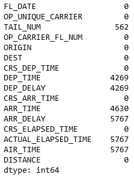

# Title

TODO: Add introduction.

## Load data from CSV files

TODO: Add intro.

1. Begin by returning to [Azure Notebooks](https://notebooks.azure.com) and creating a new notebook named "Flights" in the "Data Handling in Python" project that you created earlier. Select Python 3.6 as the language.

1. Run the following statements in the notebook's first cell to import a pair of large CSV files from Azure blob storage:

	```bash
	!curl https://topcs.blob.core.windows.net/public/flight_data_part1.csv -o part1.csv
	!curl https://topcs.blob.core.windows.net/public/flight_data_part2.csv -o part2.csv
	```

1. Now paste the following statements into the next cell to load the first CSV file into a DataFrame and show the number of rows and columns:

	```python
	import pandas as pd

	df1 = pd.read_csv('part1.csv')
	df1.shape
	```

1. Call `head()` on the DataFrame to display the first five rows:

	```python
	df1.head()
	```

1. Use these statements to load the second CSV file and show the number of rows and columns:

	```python
	df2 = pd.read_csv('part2.csv')
	df2.shape
	```

1. Call `head()` on the DataFrame to display the first five rows:

	```python
	df2.head()
	```

1. It appears that the datasets share the same schema. Use the `append()` method to merge the two and produce a new Dataframe containing all rows from both datasets, and `shape` to confirm that the combined DataFrame contains 620,000 rows:
  
	```python
	df = df1.append(df2, ignore_index=True)
	df.shape
	```

This is a rather large dataset, and like most datasets, it needs to be cleaned before it's subjected to analysis. Let's use some of what you learned in the previous lesson to whip this dataset into shape.

## Clean the data

TODO: Add intro.

1. Use the following line of code to remove duplicate rows from the dataset and count the remaining rows:

	```python
	df = df.drop_duplicates()
	df.shape
	```

	How many rows were dropped from the dataset?

1. Use this statement to list the columns in the dataset and show the number of missing values in each:

	```python
	df.isnull().sum()
	```

	Confirm that the output looks like this:

	

1. The TAIL_NUM column is missing some values, but it won't be used in any of your analysis. Use the following statement to remove it from the DataFrame:

	```python
	del df['TAIL_NUM']
	```

1. Most of other missing values are missing due to flights that were canceled or diverted to other destinations. Let's remove those rows from the DataFrame to prevent them from skewing any analysis:

	```python
	df.dropna()
	```

1. Use `df.isnull().sum()` again to examine the DataFrame for missing values. Are the results less concerning this time?

1. Finish up by displaying the dimensions of the Dataframe:

	```python
	df.shape
	```

How many rows and columns does the final DataFrame contain now?

---

Now you are ready to analyze our data. You need to 
- Load a full set of flight data
- Clean up any duplicate rows and unncessary columns 
- Retrieve the mean and maximum arrival delay time 


The two files contain some of the same data. Remove all the duplicate rows from the DataFrame. Check to make sure you have 616101 rows left after removing all the duplicates:

```python
all_flights = all_flights.drop_duplicates()
print(len(all_flights)) # outputs: 616101
```

Delete the *TAIL_NUM* column since it will not be needed for our data analysis:

```python
del all_flights['TAIL_NUM']
```

Now you can use the `mean` function to determine the mean of the ARR_DELAY column for all flights and the `max` function to determine the longest delay: 
```python
print(all_flights.ARR_DELAY.mean()) # outputs : 2.824561633466266
print(all_flights.ARR_DELAY.max()) # outputs : 2153.0
```

BONUS: Can you figure out how many flights arrived more than 10 minutes late? HINT: You don't need a comprehension, look up *filters* on pandas DataFrames.

```python
late_flights = all_flights[all_flights['ARR_DELAY']>=10]
print(len(late_flights)) # outputs : 126988
```
Congratulations you are moving data around like a professional! Now let's finish up with a look at how you visualize your data with *matplotlib*