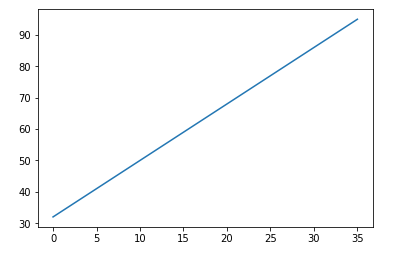
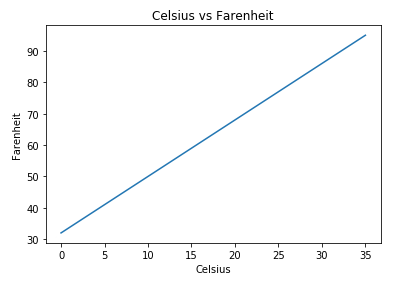
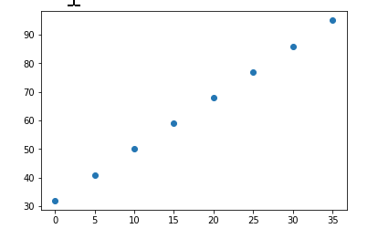
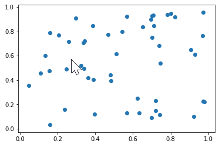
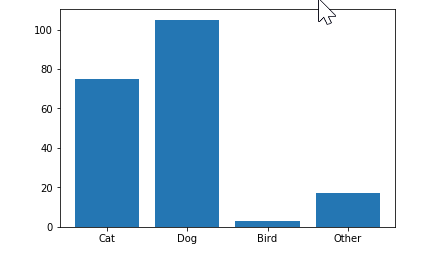
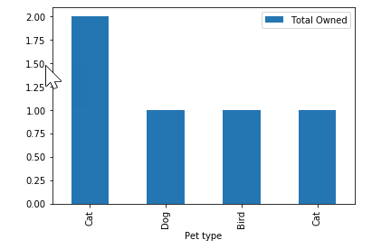
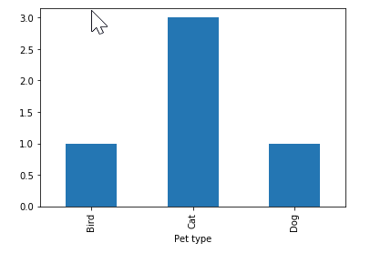
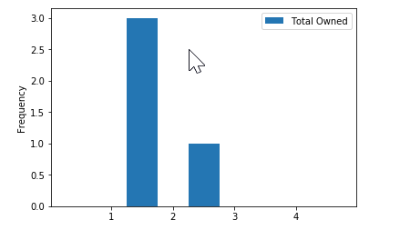

# Visualize data with Matplotlib

If a picture is worth a thousand words, then a chart or diagram drawn with Matplotlib might be worth a thousand tables. [Matplotlib](https://matplotlib.org/) is a versatile 2D plotting library for Python. A few lines of code can produce rich visuals that reveal information about the data you're dealing with as well as relationships among the variables comprising the data. Matplotlib also serves as the foundation for other popular visualization libraries such [Seaborn](https://seaborn.pydata.org/).

In the previous lessons, you learned how to store and manipulate data using Python, and the NumPy and pandas libraries. In this lesson, you will learn how to visualize data with plots and graphs using the Matplotlib library.

## Importing the Matplotlib library 

You will need the Matplotlib library for visualizations along with NumPy and pandas for data storage and manipulation:

```python
import matplotlib.pyplot as plt
import numpy as np
import pandas as pd
```

## Displaying a line graph

Using Matplotlib to display a graph follows a pattern: 
 1. Create a data object containing information you want to visualize
 2. Define a plot which determines what data to display
 3. Display the graph

Create a DataFrame containing two columns with the corresponding temperatures in Celsius and Farenheit:

```python
column_names = ['Celsius', 'Farenheit']
data = [[0,32], [5,41], [10,50], [15,59], [20,68], [25,77], [30,86], [35,95]]
temperatures = pd.DataFrame(data, columns=column_names)
```

You use the `plot` function to create a linear graph of the two temperatures. The `plot` function requires the following parameters:
- the values to plot across the x axis
- the values to plot across the y axis

After calling the `plot` function to define a graph, call the `show` function to display the graph:
```python
plt.plot(temperatures['Celsius'],temperatures['Farenheit'])
plt.show()
```
Generates the following output:


## Adding labels and titles
Graphs are easier to read when they are labelled:
- `title` adds a title to the plot
- `xlabel` adds a label to the x-axis
- `ylabel` adds a label to the y-axis

```python
plt.plot(temperatures['Celsius'],temperatures['Farenheit'])
plt.title('Celsius vs Farenheit')
plt.xlabel('Celsius')
plt.ylabel('Farenheit')
plt.show()
```
Generates the output:  


## Calling `plot` function of DataFrame
The pandas DataFrame object has a number of plotting functions. If your data is stored in a pandas DataFrame you can call the `plot` function of the DataFrame passing in the column names for the x and y axis to get the same graph:
```python
column_names = ['Celsius','Farenheit']
data = [[0,32], [5,41], [10,50], [15,59], [20,68], [25,77], [30,86], [35,95]]
temperatures = pd.DataFrame(data, columns=column_names)

# Call plot function of DataFrame 
# Passing in DataFrame column names for x and y axis
temperatures.plot(x='Celsius', y='Farenheit')
plt.title('Celsius vs Farenheit')
plt.xlabel('Celsius')
plt.ylabel('Farenheit')
plt.show()
```

## Scatter plots
[Scatter plots](https://en.wikipedia.org/wiki/Scatter_plot) are very useful when analyzing data. They allow us to determine if there might be a correlation between two columns or whether the two values are independent on each other. Basically you want to figure out does one value always go up when the other goes up? Does one value always go down when the other goes up? If there is a correlation between the values the dots displayed will form a sloped line.

Use the `scatter` function to display a scatter plot instead of a line graph:
```python
column_names = ['Celsius', 'Farenheit']
data = [[0,32], [5,41], [10,50], [15,59], [20,68], [25,77], [30,86], [35,95]]
temperatures = pd.DataFrame(data, columns=column_names)

# Call scatter function to create scatter plot
plt.scatter(temperatures['Celsius'], temperatures['Farenheit'])
plt.show()
```
Generates the output:  


If you prefer working with DataFrame functions directly, add the *kind* parameter to the DataFrame `plot` function and set it to *scatter* to generate the exact same output:
```python
# specify kind parameter = 'scatter'
temperatures.plot(x='Celsius', y='Farenheit', kind='scatter') 
plt.title('Celsius vs Farenheit')
plt.xlabel('Celsius')
plt.ylabel('Farenheit')
plt.show()
```
The dots in our scatter plot create a sloped line indicating a correlation between the two values. If there was no correlation you might see a plot like this:    


## Creating bar charts

Bar charts are another great tool for visualizing data. 
Suppose you had a DataFrame containing the total number of different pets owned by people in an appartment building:

```python
column_names = ['Pet type', 'Total Owned']
data = [['Cat',75], ['Dog',105], ['Bird',3], ['Other',17]]
pets = pd.DataFrame(data, columns=column_names)
```

To display this in a bar chart you call the `bar` function and pass in the data to use as categories, then the data to use for totals in each category:

```python
plt.bar(pets['Pet type'], pets['Total Owned'])
plt.show()
```

Generates the following output:  
  

If you prefer working directly with the DataFrame `plot` function, you can specify *bar* for the *kind* parameter to generate a bar chart:

```python
pets = pd.DataFrame(data, columns=column_names)
pets.plot(x='Pet type', y='Total Owned', kind='bar')
plt.show()
```

# Grouping data for bar charts

Sometimes the data you receive needs to be summarized before it can provide useful information in a bar chart. Imagine if instead of having the total number of each pet type, you had received raw data telling you the name of each person and what type of pet they own:

```python
column_names = ['Owner', 'Pet type', 'Total Owned']
data = [['Diane','Cat',2], ['Dave','Dog',1], ['Matt','Bird',1], ['Fahd','Cat',1]]
pets = pd.DataFrame(data, columns=column_names)
pets.plot(x='Pet type', y='Total Owned', kind='bar')
plt.show()
```
Generates the following chart showing the total pets of each type for each owner.   


It is more useful to have the total number of each pet type aggregated across all owners. To achieve this use the `groupby` function to group the data for the plot:

```python
DataFrameName.groupby(grouping)[aggregation column].aggregation().plot(kind='bar')
```

- *DataFrameName*: name of the DataFrame containing data to plot.
grouping* : name of column across which to create groups
- *aggregation column*: name of column across which to perform the aggregation (sum, count, mean, etc..)
- *aggregation*: the aggregation action to perform (sum, count, mean, etc...)

To get the total number of pets for each type of pet:
- *DataFrameName* will be *pets* 
- *grouping* will be *Pet type*
- *aggregation column* will be *Total Owned*
- *aggregation* will be *sum*

```python
pets.groupby('Pet type')['Total Owned'].sum().plot(kind='bar')
plt.show()
```

Generates the output:  


## Histograms

A histogram shows the distribution of data. Bar graphs show data for multiple columns. A histogram shows how data is distributed for a single column. 

Suppose you want to know how many people have one pet, how many people have two pets, how many people have three pets, and so on. A histogram is the perfect visualization.

To create a histogram you must specify: 
- *kind* equals *hist*
- the *bins* parameter to define how to bin each subtotal. For example:
    - bins=[0,1,2,3] would return the total number of people who own 0 pets, 1 pet, 2, pets, and 3 pets
    - bins=[0,2,4,6] would return the total number of people who have 0 or 1 pets 2 or 3 pets, 4 or 5 pets, and 6 pets
- *rwidth* is an optional parameter that specifies the width of each bar in the histogram

You can create a histogram showing how many people own how many pets:
```python
pets[['Total Owned']].plot(kind='hist',bins=[0,1,2,3,4,5],rwidth=0.5)
plt.show()
```
Generates the output:  
