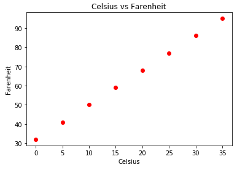
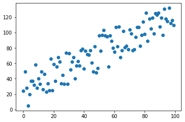
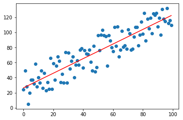

# Matplotlib

If a picture is worth a thousand words, then a chart or diagram drawn with Matplotlib is worth a thousand DataFrames. [Matplotlib](https://matplotlib.org/) is a versatile 2D plotting library for Python. A few lines of code can produce rich visuals that reveal information about the data you're dealing with as well as relationships among the values comprising the data. Matplotlib also serves as the foundation for other popular visualization libraries such [Seaborn](https://seaborn.pydata.org/), and lends its talents to Pandas so you can produce graphic depictions from Pandas DataFrames.

In previous lessons, you learned how to store and manipulate data using Python, NumPy, and Pandas. In this lesson, you will learn how to visualize data with charts and graphs using Matplotlib.

## Line charts

The first step in using Matplotlib is to import it. If you're importing it into a notebook, you also need to include the [magic command](https://ipython.readthedocs.io/en/stable/interactive/magics.html) `%matplotlib inline`, which configures Matplotlib to display output in Jupyter notebooks:

```python
%matplotlib inline
import matplotlib.pyplot as plt
```

A side effect of using `%matplotlib inline` is that you don't have to call `plt.show()` to render a plot. You can call it if if you want (and it's necessary outside of a Jupyter notebook), but it's completely optional inside a notebook.

Once `matplotlib.pyplot` is imported, you can call `plot()` on it to produce a line chart — one that connects data points with lines. The following statements create a Pandas DataFrame containing two columns with temperatures in Celsius and Fahrenheit and produce a simple line chart depicting the relationship between the two temperature scales:

```python
column_names = ['Celsius', 'Fahrenheit']
data = [[0,32], [5,41], [10,50], [15,59], [20,68], [25,77], [30,86], [35,95]]
temperatures = pd.DataFrame(data, columns=column_names)
plt.plot(temperatures['Celsius'], temperatures['Fahrenheit'])
plt.show()
```

The `plot()` method requires two parameters: the values to plot on the X axis, and the values to plot on the Y axis. After calling `plot()`, you call `show()` to display the plot. Once more, the call to `show()` is optional if you're executing this code in a Jupyter notebook:


What if you want to include a title in the output and label the X and Y axes? That's what the `title()`, `xlabel()`, and `ylabel()` methods are for:

```python
column_names = ['Celsius', 'Fahrenheit']
data = [[0,32], [5,41], [10,50], [15,59], [20,68], [25,77], [30,86], [35,95]]
temperatures = pd.DataFrame(data, columns=column_names)
plt.plot(temperatures['Celsius'],temperatures['Fahrenheit'])
plt.title('Celsius vs Fahrenheit')
plt.xlabel('Celsius')
plt.ylabel('Fahrenheit')
plt.show()
```

Here is the modified output:


The `plot()` method accepts a third parameter specifying the color and style of the lines that connect the data points. The default is to connect them with a solid blue line. Passing 'ro' in the third parameter shows the data points in red without a line connecting them:

```python
plt.plot(temperatures['Celsius'],temperatures['Fahrenheit'], 'ro')
plt.show()
``` 



See the [`plot()` documentation](https://matplotlib.org/api/pyplot_api.html#matplotlib.pyplot.plot) for a complete list of line styles, colors, and format strings. Suffice it to say that the options are as rich as they are numerous.

### Plotting with DataFrames

The Pandas DataFrame has plotting methods of its own that wrap the functionality in Matplotlib. If your data is stored in a DataFrame, you can call `plot()` on the DataFrame itself. The following example produces the same blue line chart as the example in the previous section:

```python
column_names = ['Celsius','Fahrenheit']
data = [[0,32], [5,41], [10,50], [15,59], [20,68], [25,77], [30,86], [35,95]]
temperatures = pd.DataFrame(data, columns=column_names)
temperatures.plot(x='Celsius', y='Fahrenheit')
plt.title('Celsius vs Fahrenheit')
plt.xlabel('Celsius')
plt.ylabel('Fahrenheit')
plt.show()
```

## Scatter plots

[Scatter plots](https://en.wikipedia.org/wiki/Scatter_plot) are useful for determining if there is a correlation between the values in two columns. Matplotlib's `scatter()` method creates a scatter plot. The following statements initialize a list with 100 semi-random data pairs that roughly form a line:

```python
import random

data = []
random.seed(0)

for x in range(100):
    data.append([x, x + random.randint(0, 50)])
```

These statements create a DataFrame from the list and show a scatter plot of the values:

```python
df = pd.DataFrame(data, columns=['X', 'Y'])
plt.scatter(df['X'], df['Y'])
plt.show()
```



If you prefer working with DataFrame methods directly, include a `kind='scatter'` parameter in the call to the DataFrame's `plot()` method to generate the same output:

```python
df = pd.DataFrame(data, columns=['X', 'Y'])
df.plot(x='X', y='Y', kind='scatter')
plt.show()
```

From the output, it is clear that there is a linear correlation between X values and Y values. You can use a [neat trick with NumPy](https://stackoverflow.com/questions/22239691/code-for-best-fit-straight-line-of-a-scatter-plot-in-python) to fit a line to the data points:

```python
df = pd.DataFrame(data, columns=['X', 'Y'])
plt.scatter(df['X'], df['Y'])
plt.plot(np.unique(df['X']), np.poly1d(np.polyfit(df['X'], df['Y'], 1))(np.unique(df['X'])), 'r')
plt.show()
```



This is the NumPy equivalent of using [linear regression](https://en.wikipedia.org/wiki/Linear_regression) to find the line that best fits the data. And it's a great conversation-starter at the next Matplotlib party you attend.

## Bar charts

Bar charts are another great tool for visualizing data. Suppose you have a DataFrame containing the total number of different pets owned by people in an apartment building:

```python
column_names = ['Pet type', 'Total Owned']
data = [['Cat',75], ['Dog',105], ['Bird',3], ['Other',17]]
pets = pd.DataFrame(data, columns=column_names)
```

To display this in a bar chart, you can call the `bar()` method:

```python
plt.bar(pets['Pet type'], pets['Total Owned'])
plt.show()
```

The output is as follows:

  

You can achieve the same result by calling `plot()` on the DataFrame and specifying `kind='bar'`:

```python
pets = pd.DataFrame(data, columns=column_names)
pets.plot(x='Pet type', y='Total Owned', kind='bar')
plt.show()
```

Suppose you wanted to produce the same chart, but rather than contain counts of pet types, the dataset contained the names of each pet owner in the apartment building, the type of pet they own, and the number of pets they own:

```python
column_names = ['Owner', 'Pet type', 'Total Owned']
data = [['Diane','Cat',2], ['Dave','Dog',1], ['Matt','Bird',1], ['Fahd','Cat',1]]
```

This time, the counts need to be aggregated across owners. This is a perfect application for DataFrame's `groupby()` method:

```python
pets = pd.DataFrame(data, columns=column_names)
pets.groupby('Pet type')['Total Owned'].sum().plot(kind='bar')
plt.show()
```


The parameter passed to `groupby()` is the name of the column from which to create groups. In this case, the groups are "Cat," "Dog", and "Bird." The string in square brackets identifies the column used to perform the aggregation. `.sum()` sums all the values in that column. It's a valuable technique to know about given that data doesn't always come in the form that you want.

## Histograms

Bar charts show data for multiple columns. A histogram shows how data is distributed for a single column. 

Suppose you want to know how many people in the apartment building have one pet, how many have two, and so on. You can easily create a histogram showing how many people own how many pets:

```python
column_names = ['Owner', 'Pet type', 'Total Owned']
data = [['Diane','Cat',2], ['Dave','Dog',1], ['Matt','Bird',1], ['Fahd','Cat',1]]
pets = pd.DataFrame(data, columns=column_names)
pets[['Total Owned']].plot(kind='hist', bins=[0, 1, 2, 3, 4, 5], rwidth=0.8, align='left')
plt.show()
```

The `bins` parameter specifies how many "bins" the data will be grouped into on the X axis. In this case, pet counts will appear on the X axis, and the number of people will appear on the Y:


In this example, the plot shows that three people own one pet and one person owns two.