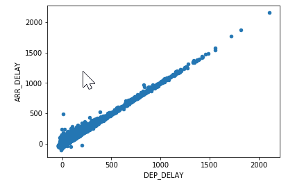
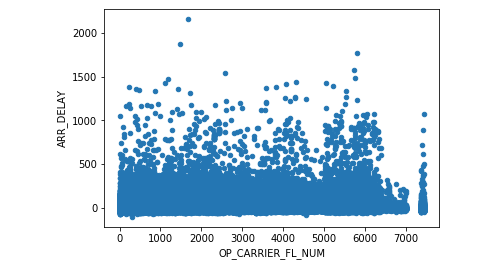
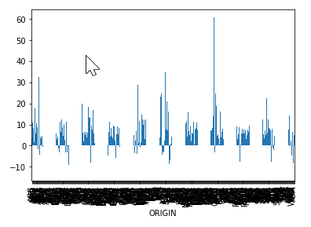
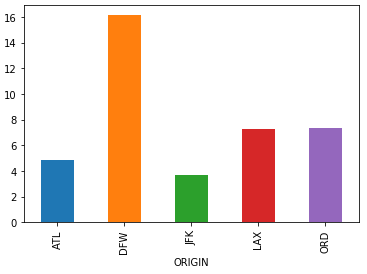
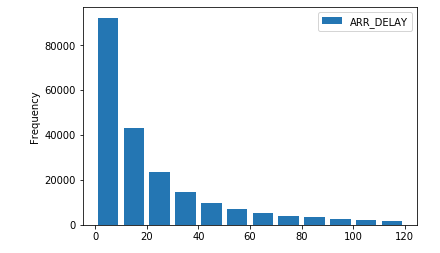

# Visualize flight data

Now that you know the basics of Matplotlib, let's use what you learned to visualize flight data and better understand why delays occur and what the main drivers are. Such information might be useful the next time you book a flight because if you knew, for example, that a flight that leaves in the late afternoon is twice as likely to be delayed as one that leaves in the morning, or that connections in and out of JFK are 50% more likely to be delayed than connections through ATL, you might alter your travel plans to increase the chance of an on-time arrival.

## Use scatter plots to test relationships

A scatter plot is a great way to visualize relationships between variables in a dataset and test hypotheses such as "morning flights are less likely to incur long delays than afternoon flights". Let's use Matplotlib to generate a few scatter plots from the "all_flights" dataset.

1. Begin by creating a new Azure Notebook named "Matplotlib" or something similar.

1. Run the following code into the first cell of the notebook to load **all_flights.csv** into a Pandas DataFrame:

	```python
	impport pandas as pd

	flight_df = pd.read_csv('all_flights.csv')
	```

	**all_flights.csv** should already be present in your Azure Notebooks project since you downloaded it in an earlier lesson. If it's not, then you can use the following command in your notebook to load it:

	```bash
	!curl https://topcs.blob.core.windows.net/public/all_flights.csv -o all_flights.csv
	```

1. Use the following statements to import Matplotlib and configure the notebook to show Matpoltlib output:

	```python
	%matplotlib inline
	import matplotlib.pyplot as plt
	```

1. It is reasonable to expect that there might be a correlation between departure delays and arrival delays since a plane that leaves late will also arrive late unless the crew can make up time in the air. Test this supposition by creating a scatter plot of departure-delay and arrival-delay values:

	```python
	flight_df.plot(kind='scatter', x='DEP_DELAY', y='ARR_DELAY')
	```

	Confirm that `plt.show()` produces the following output:

	 

	Not surprisingly, the correlation between departure delays and arrival delays is strong.

1. Use another scatter plot to check for a correlation between arrival delays and flight numbers:

	```python
	flight_df.plot(kind='scatter', x='OP_CARRIER_FL_NUM', y='ARR_DELAY')
	```

	This time, there appears to be little correlation between the two independent variables:

	

1. It might be more interesting to test for a correlation between scheduled departure times and flight delays. Due to the hub-and-spoke system used by most airlines, delays early in the day can lead to delays later in the day as well. Use the following code to test this hypothesis:

	```python
	flight_df.plot(kind='scatter', x='CRS_DEP_TIME', y='ARR_DELAY')
	```

What does the output tell you about the theory that a traveler is more likely will encounter delays by flying in mid-afternoon than early morning?

## Use bar charts to explore delays

TODO: Add intro.

1. Display a bar chart showing the mean departure delay by originating airport:

	```python
	flight_df.groupby('ORIGIN')['DEP_DELAY'].mean().plot(kind='bar')
	```

	  

1. This chart is hard to read, so let's extract only the rows for the busiest airports and show the mean departure delay for each: 

	```python
	flights_busy_airports = flight_df.loc[flight_df['ORIGIN'].isin(['ATL','LAX','ORD','DFW','JFK'])]
	flights_busy_airports.groupby('ORIGIN')['DEP_DELAY'].mean().plot(kind='bar')
	```

	Is there one airport that stands out from the rest in terms of departure delays?

	

1. Another interesting way looking at the data is to plot mean arrival delays by destination airport. Do flights into ORD, for example, incur longer delays, on average, than flights into DFW? Use the following code to find out: 

	```python
	flights_busy_airports.groupby('DEST')['ARR_DELAY'].mean().plot(kind='bar')
	```

Does the resulting plot provide any meaningful insights to the data? 

## Use a histogram to explore further

You can see from the bar charts that the mean flight delay times are quite reasonable even at the busiest airports. You also saw that the longest flight delays were significant. You need to get a sense of how many flights had small delays and how many flights had long delays.

1. Create a histogram of arrival delays to show how many flights were 0 to 10 minutes late, 10 to 20 minutes late, and so on:

	```python
	flight_df[['ARR_DELAY']].plot(kind='hist', bins=[0,10,20,30,40,50,60,70,80,90,100,110,120], rwidth=0.8)
	```

	Not surprisingly, short delays are more common than long delays:

	

1. TODO: Add second histogram scenario.

TODO: Add closing.