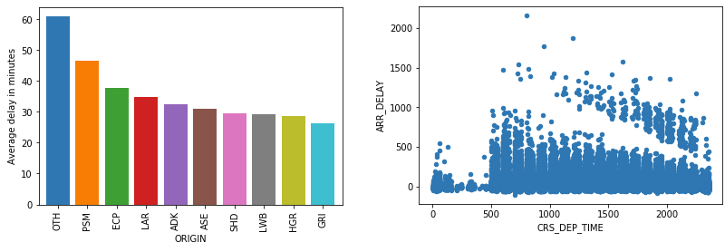

# Introduction

Imagine that you work in the Planning & Logistics department for a major airline. Your employer is concerned about the impact that flight delays are having on cost overruns and has asked you to look at the data to get a better handle on the problem. The data comes from a variety of data sources. It has been aggregated and provided to you in the form of comma-separated-value (CSV) files. As is often the case, the data is rather raw and will require cleaning — for example, removing rows and columns with missing values or replacing missing values with something else. 

Python has a number of features for manipulating data. Popular libraries such as [NumPy](https://www.numpy.org/), [Pandas](https://pandas.pydata.org/), and [Matplotlib](https://matplotlib.org/) expand Python's power and make it the perfect tool for the job. It's time to brush up on your Python skills and familiarize yourself with newer language features such as [lambda functions](https://www.w3schools.com/python/python_lambda.asp) and [comprehensions](https://medium.com/better-programming/list-comprehension-in-python-8895a785550b) that simplify data handling. And it's time to learn what Pandas and other libraries can do to make the job easier.

In this module, you will acquire the basic skills needed to tackle projects such as this one. You will produce charts and graphs like the ones below to illustrate key insights gleaned from the data. You will do your work in [Jupyter notebooks](https://jupyter.org/), which provide an interactive and easy-to-use vehicle for experimenting with Python code. Your platform will be [Azure Notebooks](https://notebooks.azure.com), which provide Jupyter-as-a-Service for free.

## Learning objectives

Here's a preview of what you will learn in this module:

- How to use sequences and other Python data structures to store data
- How to use comprehensions and lambda functions to simplify your code
- How to use NumPy to manipulate data and perform basic statistical analysis
- How to use Pandas to import data, clean it, and extract insights from it
- How to use Matplotlib to visualize data

Working with data starts with a knowledge of data structures. Let's see what Python has to offer.