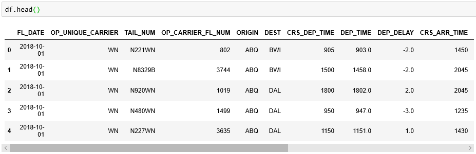

# Pandas

NumPy is great for loading data from CSV files and performing fast mathematical calculations on the data. But when it comes to cleaning, analyzing, and manipulating data, nothing beats [Pandas](https://pandas.pydata.org/). Pandas, short for *Python Data Analysis Library*, is the library that people who work with data for a living turn to for gathering insights from large datasets or preparing it for machine learning. It uses NumPy for speed and efficiency, and it goes far beyond NumPy in terms of the tools it offers for working with data. Like NumPy, Pandas is licensed under the [BSD license](https://github.com/pandas-dev/pandas/blob/master/LICENSE), enabling wide-ranging use with few restrictions.

The key data structure in Pandas is the [DataFrame](https://pandas.pydata.org/pandas-docs/stable/reference/api/pandas.DataFrame.html), which you can think of as a two-dimensional table of rows and columns with labeled axes. DataFrame includes methods for loading data from CSV files, filtering and sorting data, checking for and replacing missing values, removing rows and columns with missing values, joining DataFrames, rendering data on-screen, exporting to JSON, CSV, Excel, and SQL, and more. In all, it contains more than 200 methods and attributes. A simple call to [`DataFrame.head()`](https://pandas.pydata.org/pandas-docs/stable/reference/api/pandas.DataFrame.head.html#pandas.DataFrame.head) in a Jupyter notebook provides a concise look at the structure and content of the data:



## Working with DataFrames

A DataFrame is a two-dimensional data structure. Rows are indexed by number, and columns are indexed by name. You can create a DataFrame and initialize it with data and column names using Pandas' [`DataFrame()`](https://pandas.pydata.org/pandas-docs/stable/reference/api/pandas.DataFrame.html) method:  

```python
import pandas as pd

column_names = ['Code', 'City']
data = [['SEA','Seattle'], ['BOS','Boston'], ['HOU','Houston']]
df = pd.DataFrame(data, columns = column_names)
```

DataFrames can be sliced and diced in a manner similar to sequences. For example, you can use the [`loc`](https://pandas.pydata.org/pandas-docs/stable/reference/api/pandas.DataFrame.loc.html#pandas.DataFrame.loc) attribute to create a new DataFrame containing a subset of the rows and columns of the original. The first parameter in square brackets specifies the range of rows, and the second parameter identifies the range of columns:

```python
print(df.loc[0:1, 'Code':'City'])
```

Here's the output:

```
  Code     City
0  SEA  Seattle
1  BOS   Boston
```

You can also use `loc` to retrieve the contents of a specific row and column:

```python
print(df.loc[0,'city']) # outputs: Seattle 
```

To retrieve a row (or range of rows), specify the beginning and ending row indexes in square brackets on the DataFrame itself. `[0:1]` retrieves the first row, `[0:2]` retrieves the first two rows, and so on:

```python
df[0:1] 
```

And to retrieve a column, specify the column name:

```python
df['Code']
```

You can use conditional expressions to filter the rows that you select. For example, the following statement selects only those rows with "SEA" in the "Code" column and wraps the results in a new DataFrame, which is necessary if you wish to access the resultant rows since the inner expression — `df['Code'] == 'SEA'` — returns a Pandas Series containing True and False values:

```python
df[df['Code'] == 'SEA']
```

Need to retrieve multiple columns? You can do that, too:

```python
df[['City', 'Code']]
```
 
Or you can do this to select a range of columns:

```python
df.loc[:, 'Code':'City']
```

There are other ways to identify rows and columns in a DataFrame, including the [`iloc`](https://pandas.pydata.org/pandas-docs/stable/reference/api/pandas.DataFrame.iloc.html#pandas.DataFrame.iloc) attribute, which uses pure integer indexes. You can even use lambda functions to perform complex selections. The following example selects the even-numbered rows in a DataFrame:

```python
print(df.iloc[lambda x: x.index % 2 == 0])
```

Here is the output:

```
#   Code     City
# 0  SEA  Seattle
# 2  HOU  Houston
```

Rather than `print` a DataFrame, you can use the [`head()`]((https://pandas.pydata.org/pandas-docs/stable/reference/api/pandas.DataFrame.head.html#pandas.DataFrame.head)) method to retrieve its rows. In a Jupyter notebook, this produces a neatly formatted rendering of the DataFrame:

```python
df.head()
```


By default, `head()` returns the first five rows. To return more or fewer rows, simply specify a row count as an argument to the function.

## Reading data from CSV files

DataFrame contains a handy [`read_csv()`](https://pandas.pydata.org/pandas-docs/stable/reference/api/pandas.read_csv.html) method for loading data from CSV files, as well as [several methods for saving the contents of a DataFrame](https://pandas.pydata.org/pandas-docs/stable/reference/io.html) in a variety of formats. Suppose you have a CSV file named **airports.csv** containing the following text:

```csv
Code,City
HOU,Houston
ABQ,Albuquerque
BWI,Baltimore
```

The following code loads the contents of **airports.csv** into a Pandas DataFrame:

```python
df = pd.read_csv('airports.csv')
```

To read a tab-delimited (TSV) file rather than a CSV, use the `sep` or `delimiter` parameter:

```python
df = pd.read_csv('airports.csv', delimiter='\t')
```

And to load certain columns from the file rather than all the columns, use the `usecols` parameter (or its equivalent, `names`) with a list a column names:

```python
df = pd.read_csv('airports.csv', delimiter='\t', usecols=['Code', 'City'])
```

What if the CSV or TSV file doesn't contain a header row? In that case, specify `header=None`. If you would like to assign names to the columns, simply follow up with a statement that specifies column names with the `columns` attribute:

```python
df = pd.read_csv('airports.csv', header=None)
df.columns = ['Code', 'City']
```

`read_csv()` supports other parameters as well, including `skipinitialspace`, which ignores white space after delimiters, and `nrows`, which reads the specified number of rows and is useful when dealing with very large files. For a complete list of parameters supported by `read_csv()`, refer to the [read_csv() documentation](https://pandas.pydata.org/pandas-docs/stable/reference/api/pandas.read_csv.html#pandas.read_csv).

## Cleaning and sorting data

One of the reasons Pandas is so popular is that DataFrame includes numerous methods for cleaning data. For example, the `drop_duplicates()` method removes duplicate rows from a DataFrame, which is often a precursor to training a machine-learning model:

```python
df = df.drop_duplicates()
```

Another common use case for Pandas is identifying rows and columns with missing values and either removing those rows and columns or replacing the missing values. Here's a quick way to list all the columns in the DataFrame and show a count of missing values in each one:

```python
df.isnull().sum()
```

If you would like to examine the rows that are missing values, this statement selects all of them:

```python
df[df.isnull().values.any(axis=1)]
```

One approach to dealing with missing values is removing rows that contain them. One line of code is sufficient to make that happen:

```python
df = df.dropna()
```

You can also remove entire columns from a DataFrame:

```python
del df['ARR_DELAY']
```

Another approach is to replace missing values with real values. That's easy enough with DataFrame's [`fillna()`](https://pandas.pydata.org/pandas-docs/stable/reference/api/pandas.DataFrame.fillna.html#pandas.DataFrame.fillna) method, which replaces missing values with a specified value. The following example replaces all missing values in the DataFrame with 0s:

```python
df = df.fillna(0)
```

And this example replaces all missing values in the ARR_DELAY column with 1s:

```python
df = df.fillna({'ARR_DELAY': 1})
```

You can also sort the contents of a DataFrame. The next example sorts first by the values in the "City" column, and then by values in the "Code" column:

```python
df = df.sort_values(by=['City', 'Code'])
```

By default, Pandas performs ascending sorts. If you want to do a descending sort instead, include an `ascending=False` parameter in the call to `sort_values()`.

## Merging and joining data

It's not uncommon for data to be delivered in multiple CSV files or aggregated from several data sources. DataFrame's [`append()`](https://pandas.pydata.org/pandas-docs/stable/reference/api/pandas.DataFrame.append.html#pandas.DataFrame.append) method makes it easy to append the contents of another DataFrame to an existing DataFrame:

```python
df = df.append(other_df, ignore_index=True)
```

The `ignore_index=TRUE` parameter tells the method to renumber (reindex) the rows that are appended. Without that, you would have two rows with index 0, two rows with index 1, and so on.

You can also join DataFrames in a manner that is analagous to performing a JOIN in SQL. Suppose you have one DataFrame containing airport codes and cities:

```python
column_names = ['airport_code', 'city']
data = [['DTW','Detroit'], ['LGA','New York'], ['DUL','Washington']]
airports = pd.DataFrame(data, columns = column_names)
```

And another DataFrame with airport codes and flight information:

```python
column_names = ['departure_date', 'dest_airport', 'dep_time', 'flight_num']
data = [['12/31/2019','DTW','08:15',499], ['12/31/2019','LGA','09:35',748] , ['12/31/2019','LGA','13:15',749]]
flights = pd.DataFrame(data, columns = column_names)
```

The following statement joins the DataFrames, performing the equivalent of an INNER JOIN on the "airport_code" and "dest_airport" columns:

```python
df = pd.merge(flights, airport_codes, how='inner', left_on= 'dest_airport', right_on='airport_code')
```

The resulting DataFrame is rendered this way in a Jupyter notebook:


Observe that the resulting DataFrame has two columns containing airport codes. Could you write one line of code to remove one of the columns?

## Grouping data

One of DataFrame's most powerful features is its ability to group data. The [`groupby()`](https://pandas.pydata.org/pandas-docs/stable/reference/api/pandas.DataFrame.groupby.html) method groups data according to criteria that you specify. As an example, assume that you create a simple DataFrame containing delays (in minutes) for a selection of airports:

```python
column_names = ['Airport', 'Delay']
data = [['SEA', 10], ['BOS', 4], ['SEA', 6], ['SEA', -2], ['ATL', 8]]
df = pd.DataFrame(data, columns = column_names)
```

Now you want to compute average delays for each airport. The following statement groups the data by airport code and uses the `mean()` method (yes, DataFrame has methods similar to NumPy's for performing mathematical operations on data) to compute mean delays for each group:

```python
print(df.groupby('Airport')['Delay'].mean())
```

The output looks like this:

```
Airport
ATL    8.000000
BOS    4.000000
SEA    4.666667
```

If you want just the mean for Seattle, you can do it this way:

```python
print(df.groupby('Airport')['Delay'].mean()['SEA']) # outputs: 4.666666666666667
```

You can also use this approach, which uses a conditional expression rather than `groupby()`:

```python
print(df[df['Airport'] == 'SEA']['Delay'].mean()) # outputs: 4.666666666666667
```

There is much more that you can do with DataFrames, but let's pause for now and put what you already know to work analyzing a much larger set of flight-delay information.