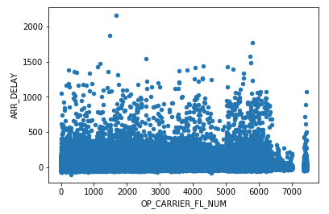
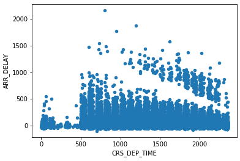

# Exercise: Use Matplotlib to visualize data

It's Monday morning, and while Pandas helped earn you a weekend away from the office, management wants a report with flashy visuals to help convey some of the conclusions that you reached regarding flight delays. Thankfully, Matplotlib works the same magic for visuals that Pandas does for raw data. Let's use what you learned about Matplotlib to present the data in a way that even a manager can understand.

## Create a notebook and load a dataset

As usual, let's use Azure Notebooks to host your code.

1. Begin by returning to [Azure Notebooks](https://notebooks.azure.com) and creating a new notebook named "Matplotlib" in the "Data Handling in Python" project that you created earlier. Select Python 3.6 as the language.

1. Run the following statement in the notebook's first cell to import a large CSV file from Azure blob storage:

	```bash
	!curl https://topcs.blob.core.windows.net/public/all_flights.csv -o flights.csv
	```

1. Now run the following code in the next cell to load **flights.csv** into a Pandas DataFrame and count the rows and columns in the dataset:

	```python
	impport pandas as pd

	df = pd.read_csv('flights.csv')
	df.shape
	```

1. Use the following statements to import Matplotlib and configure the notebook to show Matpoltlib output:

	```python
	%matplotlib inline
	import matplotlib.pyplot as plt
	```

## Use scatter plots to explore relationships

A scatter plot is a great way to visualize relationships between variables in a dataset and test hypotheses such as "morning flights are less likely to incur long delays than afternoon flights". Let's use Matplotlib to generate a few scatter plots from the dataset.

1. It is reasonable to expect that there might be a correlation between departure delays and arrival delays since a plane that leaves late will also arrive late unless the crew can make up time in the air. Test this supposition by creating a scatter plot of departure-delay and arrival-delay values:

	```python
	df.plot(kind='scatter', x='DEP_DELAY', y='ARR_DELAY')
	```

	Confirm that this produces the following output:

	 

	Not surprisingly, the correlation between departure delays and arrival delays is strong.

1. Use another scatter plot to check for a correlation between arrival delays and flight numbers:

	```python
	df.plot(kind='scatter', x='OP_CARRIER_FL_NUM', y='ARR_DELAY')
	```

	This time, there appears to be little correlation between the two independent variables:

	

1. It might be more interesting to check for a correlation between scheduled departure times and flight delays. Due to the hub-and-spoke system used by most airlines, delays early in the day can lead to delays later in the day as well. Use the following code to test this hypothesis:

	```python
	df.plot(kind='scatter', x='CRS_DEP_TIME', y='ARR_DELAY')
	```

	

What does the output tell you about the theory that a traveler is more likely to encounter delays by flying in mid-afternoon than early morning?

## Use bar charts to visualize delays at individual airports

Now let's use bar charts to visualize delays at individual airports and determine at which airports travelers are most likely to encounter delays. 

1. Display a bar chart showing the mean departure delay by originating airport:

	```python
	df.groupby('ORIGIN')['DEP_DELAY'].mean().plot(kind='bar')
	```

	  

1. This chart is hard to read, so let's extract only the rows for the busiest airports and show the mean departure delay for each: 

	```python
	flights_busy_airports = df.loc[df['ORIGIN'].isin(['ATL','LAX','ORD','DFW','JFK'])]
	flights_busy_airports.groupby('ORIGIN')['DEP_DELAY'].mean().plot(kind='bar')
	```

	Is there one airport that stands out from the rest in terms of departure delays?

1. A couple of lessons ago, you used a fairly complex line of code to determine which ten airports suffer the longest average departure delays. Build on what you did there to show the data in a bar chart:

	```python
	ax = df.groupby('ORIGIN')['DEP_DELAY'].mean().sort_values(ascending=False).head(10).plot(kind='bar', width=0.8)
	ax.set_ylabel('Average delay in minutes')
	```

	The results look like this, once more confirming that Southwest Oregon Regional Airport is probably not a favorite among frequent flyers:

	 

One nuance of the last code snippet is that a call to `plt.ylabel()` won't add a label to the Y axis. In these situations, you can call `set_ylabel()` on the `AxesSubplot` object returned by the DataFrame's `plot()` method.

## Use a histogram to explore the frequencies of delays

Let's say the goal is to learn more about the nature of the delays — specifically, how the number of short delays compares to the number of long delays. It's reasonable to expect that there are more 10-minute delays than 1-hour delays. But what does the distribution look like? 

1. Create a histogram of arrival delays to show how many flights were 0 to 10 minutes late, 10 to 20 minutes late, and so on:

	```python
	flight_df[['ARR_DELAY']].plot(kind='hist', bins=[0,10,20,30,40,50,60,70,80,90,100,110,120])
	```

1. Confirm that the output looks like this:

	

Not surprisingly, short delays are more common than long delays, and thankfully, the number of delays drops off rapidly as the length of the delay increases.