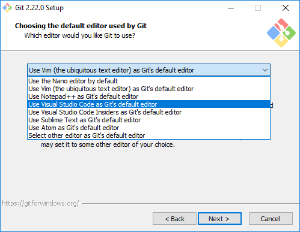

# Install and configure Git

It's time to install Git on your computer and configure it for first use. If you're not sure whether Git is installed, open a Command Prompt window (Windows) or terminal (macOS and Linux) and execute the following command:

```bash
git --version
```

If a version number is displayed, then Git is installed and you can skip ahead to the section entitled [Configure Git](#configure-git). Otherwise, follow the instructions in the next section to install Git.

## Install Git 

Git is available for free for Windows, macOS, and Linux. How you install it depends on which operating system you're using.

### Install Git on Windows

To install Git on a Windows PC, go to https://git-scm.com/download/win and install the latest version of [Git for Windows](https://gitforwindows.org/). When prompted to choose a default editor, we recommend [Visual Studio Code](https://code.visualstudio.com/), Microsoft's free cross-platform source-code editor. Any editor will do, but the default is [Vim](https://en.wikipedia.org/wiki/Vim_(text_editor)), which although extremely powerful is not beginner-friendly. You may accept the defaults everywhere else.



_Selecting a text editor_

You can also get the Git command-line tools by installing [GitHub Desktop](https://desktop.github.com/). But don't confuse Git with [GitHub](https://github.com/) and GitHub Desktop. GitHub is a popular source-code repository owned by Microsoft that uses Git for version control. GitHub Desktop is a cross-platform GUI for GitHub. You use Git to interact with GitHub, but you can use Git independently of GitHub, too.  

### Install Git on macOS

Git is included with the Xcode command-line tools. If you use macOS 10.9 or higher, simply execute a  Git command in a terminal window:

```bash
git --version
```

If Git isn't already installed, the operating system will prompt you to install it. The most recent version of Git for macOS is also available for download from https://git-scm.com/download/mac.

### Install Git on Linux

All of the major Linux distributions have Git in their package archives, which makes installation a snap. On Ubuntu and other Debian-based distributions, use this command:

```bash
sudo apt install git-all
```

If you have a slow connection or are using a computer with limited disk space, use the following command instead to install only the packages necessary for the exercises in this module. You may omit `git.el` if Emacs isn't your default text editor:

```bash
sudo apt install git git-doc gitk git-gui git.el
```

On Fedora and other RPM-based distributions, use `dnf` rather than `apt`:

```bash
sudo dnf install git-all curl
```

The Git website includes installation instructions for [other Linux and Unix distributions](https://git-scm.com/download/linux).

<a name="configure-git"></a>
## Configure Git

Now that Git is installed, let's set it up so you can start working with it.

1. Open a Command Prompt window if you're running Windows, or a terminal if you're running macOS or Linux.

1. Git relies on configuration variables managed with the [git config](https://git-scm.com/docs/git-config) command. It uses a combination of local configuration variables stored in a directory named ".git" in each Git repo, global configuration variables stored in a file in your home directory, and system configuration variables in a file whose location is operating-system-dependent. Use the following command to display these variables:

	```bash
	git config --show-origin --list
	```

	If you run this command on Windows following a fresh install of Git, you'll see something like this:

	```
	file:"C:\\ProgramData/Git/config"       core.symlinks=false
	file:"C:\\ProgramData/Git/config"       core.autocrlf=true
	file:"C:\\ProgramData/Git/config"       core.fscache=true
	file:"C:\\ProgramData/Git/config"       color.diff=auto
	file:"C:\\ProgramData/Git/config"       color.status=auto
	file:"C:\\ProgramData/Git/config"       color.branch=auto
	file:"C:\\ProgramData/Git/config"       color.interactive=true
	file:"C:\\ProgramData/Git/config"       help.format=html
	file:"C:\\ProgramData/Git/config"       rebase.autosquash=true
	file:C:/Program Files/Git/mingw64/etc/gitconfig http.sslcainfo=C:/Program Files/Git/mingw64/ssl/certs/ca-bundle.crt
	file:C:/Program Files/Git/mingw64/etc/gitconfig http.sslbackend=openssl
	file:C:/Program Files/Git/mingw64/etc/gitconfig diff.astextplain.textconv=astextplain
	file:C:/Program Files/Git/mingw64/etc/gitconfig filter.lfs.clean=git-lfs clean -- %f
	file:C:/Program Files/Git/mingw64/etc/gitconfig filter.lfs.smudge=git-lfs smudge -- %f
	file:C:/Program Files/Git/mingw64/etc/gitconfig filter.lfs.process=git-lfs filter-process
	file:C:/Program Files/Git/mingw64/etc/gitconfig filter.lfs.required=true
	file:C:/Program Files/Git/mingw64/etc/gitconfig credential.helper=manager
	```

1. The only global configuration variables that *must* be defined are `user.name` and `user.email`. Both are required for commits; neither is present in the output above. Git tries to guess these based on your user name and your computer's name and DNS domain, but then it complains every time you make a commit. Rightly so, because its guess is almost always wrong.

	If the output from `git config --show-origin --list` does *not* include variables named `user.name` and `user.email`, use the following commands to create them, replacing USER_NAME with your name and USER_EMAIL with your e-mail address:

	```bash
	git config --global user.name USER_NAME
	git config --global user.email USER_EMAIL
	```

1. If you're using Windows, you have a little more work to do. Windows uses the CRLF (Carriage Return/Line Feed) character combination to end lines in text files, but Unix-based operating systems such as Linux and macOS use just line feeds. Git uses the Unix convention by default, so if you collaborate with people who use a different operating system, you need to tell Git to convert line endings. To that end, execute the following commands:

	```bash
	git config --global core.autocrlf true
	git config --global core.safecrlf true
	```

	There's a good discussion of this problem in [Mind the End of Your Line](https://adaptivepatchwork.com/2012/03/01/mind-the-end-of-your-line/) by [Tim Clem](https://adaptivepatchwork.com/about/). There are some additional subtleties that Windows users may need to watch out for later, but the defaults are all you need for this module. 

1. Now execute the following command again:

	```bash
	git config --show-origin --list
	```

	Confirm that the output includes four lines similar to the following. Your name and e-mail address will be different, of course, and the paths will be different on macOS and Linux:

	```
	file:C:/Users/scottgu/.gitconfig      user.name=scottgu
	file:C:/Users/scottgu/.gitconfig      user.email=scottgu@microsoft.com
	file:C:/Users/scottgu/.gitconfig      core.autocrlf=true
	file:C:/Users/scottgu/.gitconfig      core.safecrlf=true
	```

In the next unit, you learn how to set up a project so you can use Git to track changes.
