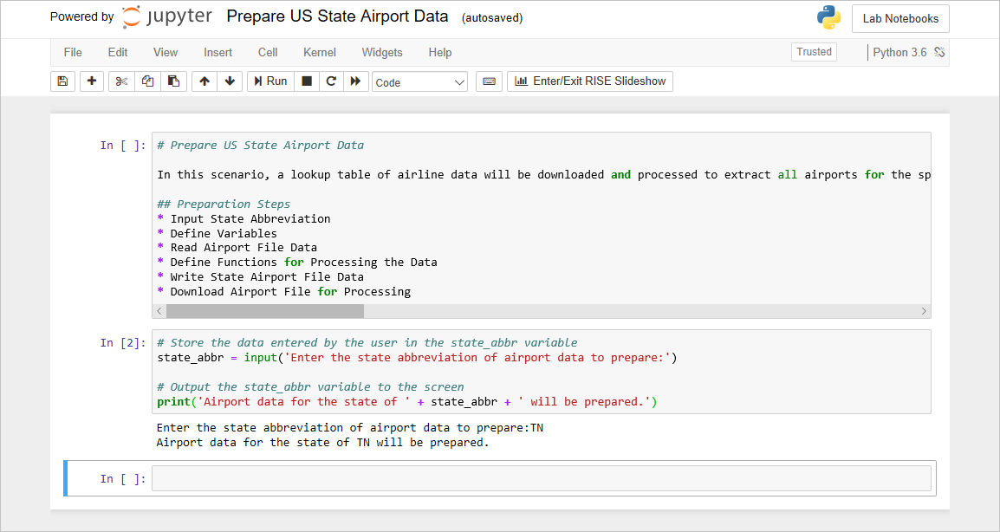

# Use functions to organize code

Computer programs grow in size quickly. Almost every program has parts of its code which needs to be repeated over and over again. Consider the following code:

```python
items = ['apples', 'oranges', 'bananas']

for item_index, item in enumerate(items):
    print(str(item_index + 1) + '. ' + item)
    
print('')

items = ['carrots', 'broccoli', 'corn']

for item_index, item in enumerate(items):
    print(str(item_index + 1) + '. ' + item)
```

Both loops do exactly the same thing. They iterate over a list of items, printing each item with a numbered prefix indicating its position in the list. Repeating the code for both loops is poor program design. The program is larger and if there are changes which need to be made to the loop, they need to be made twice. If the program was large enough it could be hard to find all of the places this code was repeated, therefore making it hard to make consistent changes. Also, if there is a bug in the code the bug would be repeated over and over again making it hard to fix. Overall, the repeated code makes a program harder to maintain over time.

## Functions

To solve the problems of repeated code and bad program design functions are used. Functions allow repeated code to be stored in one place and all for it to be parameterized. A parameterized function can be called many times with different argument value passed in each time allowing the function to be customized for a particular use. A function is defined with the `def` statement:

```python
def print_item_list(the_items):
    for item_index, item in enumerate(the_items):
        print(str(item_index + 1) + '. ' + item)
```

Observe the `def` statement defining the function. Following the `def` statement is the name of the function. Generally, the convention for multi-word function names is to use underscores between the words. Finally, the parameter for the function is a variable named `the_items`. Functions can have multiple parameters which are comma separated.

Here is the code for updating the Python program to use the function:

```python
def print_item_list(the_items):
    for item_index, item in enumerate(the_items):
        print(str(item_index + 1) + '. ' + item)
    
items = ['apples', 'oranges', 'bananas']
print_item_list(items)

print('')

items = ['carrots', 'broccoli', 'corn']
print_item_list(items)
```

To call (or invoke) the function the function name followed by paratheses is used. If a function has parameters which need to be passed they are passed within the paratheses. In the code above, the argument is `items` and the parameter it is assigned to is `the_items`. The argument and the parameter do not have to have the same name and they rarely are the same name.

The above example is a custom function coded by the programmer, but there are many functions built into the Python code library. For example, the call to the function `lower` from the previous topic is a call to a function built into Python string objects. Also, the call to the `enumerate` function is another of a built-in Python function.

The `enumerate` function is a very useful function. It is used to iterate over a sequence and it itself returns a sequence type known as a `tuple`. The `tuple` is an immutable sequence which is commonly used to return multiple values from a function such as in the case of the `enumerate` function. The `tuple` returned from the `enumerate` function call contains the item index in the sequence and the item itself. The coding technique which assigns the `tuple` to the individual variables `item_index` and `item` is known as destructuring. Destructuring is used to avoid creating a `tuple` object where its elements are accessed via an index, and instead creates two variables which can be plainly named making the code easier to read.

The following code is valid, but harder to read:

```python
def print_item_list(the_items):
    for the_item in enumerate(the_items):
        print(str(the_item[0] + 1) + '. ' + the_item[1])
```

This is easier to read:

```python
def print_item_list(the_items):
    for item_index, item in enumerate(the_items):
        print(str(item_index + 1) + '. ' + item)
```

### Returning data from a function

All functions in Python return a value even if not explicitly stated. Functions without an explicit return value return `None`. To return a value the `return` statement is used.

```python
def add(a,b):
    return a + b
```

Observe the `add` function will accept two parameters, `a` and `b`, will calculate the sum, and return the calculated value.

The `return` type will be whatever the type of the return value is:

```python
def add(a,b):
    return a + b

result = add(1,2)

print(type(result)) # outputs: <class 'int'>
```

For functions without an explicit return value, the value of `None` is returned:

```python
def do_it():
    print('did it')
    
result = do_it()

print(result) # outputs: None
print(type(result)) # outputs: <class 'NoneType'>
```

The `None` value simply means the absence of a value and it is a falsy value.

### Default parameter values

Function parameters can be configured to have default values. When a parameter has a default value it does not need to be passed in. If a value other than the default value is needed then it can be passed in.

```python
def display_message(msg, msg_type = 'INFO'):
    print(msg_type + ': ' + msg)

display_message('Hello!')

display_message('Hello!', 'ALERT')
```

### Named parameters

When passing arguments named parameters may be used in the function call. Using named parameters allow specific parameters to have values assigned to them without relying upon the comma-separated order.

```python
def display_message(msg, msg_type = 'INFO'):
    print(msg_type + ': ' + msg)

display_message('Hello!', msg_type = 'ALERT')
```

### Lambda functions

Lambda functions are anonymous functions (functions that have no name) defined on one line as a single expression. Commonly, they are passed directly as arguments to other functions.

```python
add = lambda a,b: a + b
print(add(1, 2)) # outputs: 3
```

Observe the lambda function being assigned to a variable and then called with two arguments.

The following is an example of defining the lambda as an argument in another function call.

```python
def op(theOp, a, b):
    return theOp(a, b)

print(op(lambda a,b: a + b, 1, 2))
```

## Filter airport data by US state

Now let's put what you have learned about functions to work in the notebook you are assembling.

1. Return to the Azure notebook that you created previously.

	

	_Jupyter notebook in Azure_

1. Add a new Python cell to the end of the notebook.

1. In the new cell, add a function named `parse_airport_data` which will receive raw airport data and return dictionay containing a `code` field and a `name` field. The `code ` field should be populated from the "Code" column of the "airports.csv" file. The `name` field should be populate from the "Description" column of the "airports.csv" file.

	```python
	def parse_airport_data(airport_data):
	    
	    # skip first character (a double quote), and start with second character (index = 1)
	    airport_data_start = 1
	    
	    # ignore last character (a double quote), minus 2 because of zero-based indexes
	    airport_data_end = len(airport_data) - 2
	    
	    # slide off first and last character
	    airport_data_temp = airport_data[airport_data_start:airport_data_end]
	    
	    # split on quoted comma to get airport code and name
	    code, name = airport_data_temp.split('","')
	    return {
	        'code': code,
	        'name': name
	    }
	```

1. Add a function named `filter_airports_by_state` to the new cell. The function will receive a list of airports and return a filtered list of airports for a particular state.

	```python
	def filter_airports_by_state(airports, filter_by_state_abbr):
	    
	    filtered_airports = []
	    formatted_state_abbr = ' ' + filter_by_state_abbr + ':'
	    
	    # in statement can be used with for-in loops to iterate over sequences and
	    # can be used with the if statement to check a sequence to see if it contains
	    # a value
	    for airport in airports:
	        if formatted_state_abbr in airport['name']:
	            filtered_airports.append(airport)
	    
	    return filtered_airports
	```

1. Add a function named `airport_to_csv` to the new cell. The function will return an airport formatted to be a row of CSV data.

	```python
	def airport_to_csv(airport):
	    return '"' + airport['code'] + '","' + airport['name'] + '"'
	```

1. Declare a new variable named `all_airports` and initialize it to an empty list. Iterate over all of the airport data, parse each item of airport data and append it to the `all_airports` list.

	```python
	all_airports = []
	for airport_data in all_airports_data:
	    all_airports.append(parse_airport_data(airport_data))
	```

1.  Use the `state_abbr` variable whose value was capture by the `input` statement and produce a list of airports filtered by the state abbreviation. Store the filtered list in a variable named `state_airports`.

	```python
	state_airports = filter_airports_by_state(all_airports, state_abbr)
	```

1. Create a new variable named `state_airports_data` and initialize it to an empty string. Iterate over the list of `state_airports` and produce a string of newline separated state airport CSV formatted date. 

	```python
	state_airports_data = ''
	for state_airport in state_airports:
	    state_airports_data = state_airports_data + airport_to_csv(state_airport) + '\n'
	```

1. Print the string of `state_airports_data` to ensure the data was extracted as expected.

TODO: Add closing.