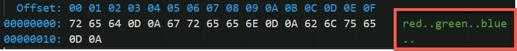
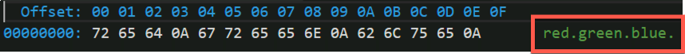
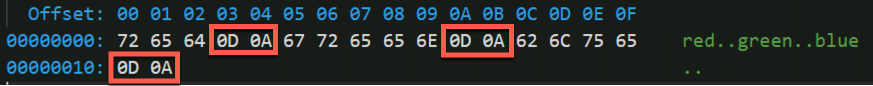
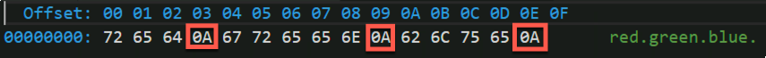
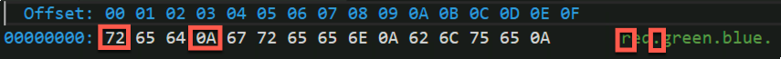
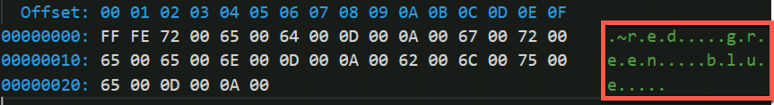

# Read and write files

Computer programs are composed of code and data. Variables are used to store data, control flow structures apply logic to the data and method/functions are used to organize logic. Typically, data for computer programs come from external sources including databases, the file system and over computer networks such as downloading a web page.

To open a file from the file system in Python the open function is used. The open function's first two parameters are the file name path and the mode for opening the file. Files can be opened in one of many modes such as read, write, and append. The read, write, and append modes are specified with one of the following string values:

Modes
- read: 'r'
- write: 'w'
- append: 'a'

There are additional modes beyond these, but they are outside the scope of this course.

Files can contain binary or text data. Binary data is very common for operating system files and executable programs. Occasionally, some applications will store their data in a binary format especially for data such as images, sound, video, and other media data. Binary files are not covered in this module.

Most non-media files containing data used for data science and machine learning will be stored as text and usually in a format such as comma-delimited or tab-delimited. Here is an example of a comma-separated values file (CSV):

```csv
Code,Description
"01A","Afognak Lake, AK: Afognak Lake Airport"
"03A","Granite Mountain, AK: Bear Creek Mining Strip"
"04A","Lik, AK: Lik Mining Camp"
"05A","Little Squaw, AK: Little Squaw Airport"
"06A","Kizhuyak, AK: Kizhuyak Bay"
"07A","Klawock, AK: Klawock Seaplane Base"
"08A","Elizabeth Island, AK: Elizabeth Island Airport"
```

In fact, delimited files are so common that popular Python data manipulation libraries such pandas can process delimited files natively making it much easier to work with such data in Python applications. In this module, the focus is on reading and writing files using Python-only (no additional packages).

### Writing to a File

To read from and append to existing files or write to new files, the file must first be opened. Here is an example of a file being opened for writing:

```python
color_file = open('./colors.txt', 'w')
```

Once the file is opened, data can be written to it:

```python
colors = ['red','green','blue']

for color in colors:
    color_file.write(color + '\n')
```

The new line character '\n' is appended to the end of every line so there is one color per line in the `colors.txt` file. Once the data has been written to the file, the file must be closed:

```python 
color_file.close()
```

Closing the file is important to free up operating system resources and to make the file available to other applications as needed. To simplify the process of opening and closing the file the `with` statement is used:

```python
with open('./colors.txt', 'w') as color_file:

    colors = ['red','green','blue']
	
    for color in colors:
        color_file.write(color + '\n')
```

Once the code exits the `with` statement block the file is closed.

### Reading from a File

To open the file for reading, the open function is invoked with the existing file name and the mode value of 'r':

```python
colors = []

with open('./colors.txt', 'r') as color_file:
```

The opened color_file is iterable and can be used with a for-in loop to read each line of data. The rstrip function will remove all of the trailing whitespace (including the newline character) from the line of data read.

```python   
    for color_data in color_file:
        color = color_data.rstrip()
```

Each color is appended to the list of colors.

```python        
        colors.append(color)

print(colors)
```

Here is the complete code sample:

```
colors = []

with open('./colors.txt', 'r') as color_file:
    for color_data in color_file:
        color = color_data.rstrip()
        colors.append(color)

print(colors)
```

Please run the above within a cell of the notebook. Ensure there is a colors.txt file.

### Appending to a File

In addition to writing to a new file and reading from an existing file, appending to an existing file is possible too. Append has many uses such as logging application events to a file for debugging problems which occur. Change the mode to 'a' for append and when the file is opened and new data is written to it, it will be appended to what is there versus overwriting it.

```python
new_colors = ['orange','yellow','purple']

with open('./colors.txt', 'a') as color_file:
    
    for color in new_colors:
        color_file.write(color + '\n')
        
colors = []
        
with open('./colors.txt', 'r') as color_file:
    
    for color_data in color_file:
        color = color_data.rstrip()
        
        colors.append(color)

print(colors)
```

### Writing Python Programs for Multiple Operating Systems

As mention in the introduction, Python runs on most operating systems. While the execution of most Python code on various operating systems behaves exactly the same, from time-to-time, specials considerations specific to the operating system must be taken into account. Two such considerations are line endings and the file/character encoding for text files. Why does this matter? Many Python applications consume data collected from many different platforms some of them quite old. Not being aware of considerations such as line endings and file encoding can lead to bad data being imported.

#### Line Endings

Microsoft Windows uses two characters for line endings "\r\n" and Unix-variant systems such as Apple's macOS and Linux (all distros) use a single character "\n" for line endings. When writing Python applications it can be important to make note of this difference. When writing code which writes to a file only the new line character '\n' should be written regardless of the operating system. Python will translate the new line character into the appropriate line ending depending upon the operating system being used.

To determine the line ending used by the operating system, import the `os` module and observe the value returned by `linesep`:

```python
import os

os.linesep
```

Do not use `os.linesep` when writing files as the Python language takes care of performing line ending translation for you.

```python
colors = ['red','green','blue']

with open('./colors.txt', 'w') as color_file:

    for color in colors:
        color_file.write(color + '\n')
```

On Windows, the above Python code produces the following file content:



On Unix-variants (macOS and Linux), the same Python code from above outputs the following file content:



Observe that the Windows version contains two dots between the colors and the Unix-variant version contains one dot between the colors. The dots represent the carriage return '\r' and line feed '\n' characters. Observe in the screenshot below, the hexadecimal values for the carriage return (0D) and newline (0A) in the file saved on Windows.



Next, observe the new line (0A) only hexadecimal value for the file saved on a Unix-variant.



Same code Python code, same data yet different file content results because of the operating system upon which Python was executing.

#### File Encoding

Another important consideration is file encoding (also known as character encoding). Computers represent a character as a number. For example, in the previous screenshots, the characters are stored as hexadecimal numbers. The new line is the hexadecimal number 0A which has a decimal value of 10.  The letter 'r' has a hexadecimal value of 72 which has a decimal value of 114.



The number specifies a character in a look-up table. Specifying the character encoding is specifying which character lookup table is being used. Different tables have different purposes. In the early days of computing, a common encoding was the ASCII encoding. As computing became more internationalized more characters were needed so a new encoding called Unicode was created. Unicode comes in several flavors depending upon the number of characters which need to be supported within an application. The more characters supported by the look-up table the more memory and drive space the characters take.

For example, web pages typically use UTF-8 while operating systems typically use UTF-16. Diving into the details of different encodings is outside the scope of this tutorial other than to say that Python will use the preferred encoding determined by the local environment for writing files. For most systems, this will be UTF-8.

When reading and writing files the character encoding (also known as file encoding) can be explicitly set (if needed) when opening the file.

```python
colors = ['red','green','blue']

with open('./colors.txt', 'w', encoding='utf-8') as color_file:

    for color in colors:
        color_file.write(color + '\n')
```

The default encoding for reading files is determined by the file. The default encoding for writing files is determined by the result of the `locale.getpreferredencoding` function.

```python
import locale

print(locale.getpreferredencoding())
```

The UTF-8 encoding can read ASCII files so if only older ASCII files or modern UTF-8 encoded files are the only sources of data then the defaults will work on most systems. However, if a data source is encoded in UTF-16 then the encoding will need to be set to read it. Also, if the output needs to be UTF-16 then the encoding will need to be set as well.



The above screenshot is the same color content produced earlier but this time the encoding is UTF-16. You will notice that characters take up twice as much space at UTF-8. If this UTF-16 content is read at UTF-8 the data will not be loaded correctly. To load this content into Python. the encoding parameter for the open function would need to be set to UTF-16.

## Save Airport Data for a US State to a File

1. If not open, open the "Prepare US State Airport Data" notebook created in the previous exercise.

1. Add a new Python cell to the end of the notebook.

1. In the new cell, open a new file for writing with the file name specified by the `state_airport_file_name` variable. Use the `with` statement syntax.

```python
with open(state_airport_file_name, 'w') as state_airport_file:
```

1. With the header '"Code","Name"', a newline and the contents of the variable `state_airports_data` to the file with the block of the `with` statement.

```
    state_airport_file.write('"Code","Name"' + '\n' + state_airports_data)
```

1. Run the entire notebook and verify the content of the file.