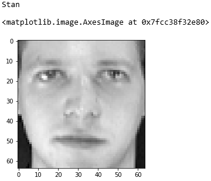

# Define characteristics with attributes

Attributes hold the data that defines an object. For a pink flower, "pink" is an attribute of the flower. If you wrote a `flower` class, you might include an attribute named `color` that describes the flower's color. You might also include an attribute indicating the flower's type — for example, iris, tulip, or rose. Objects are not required to have attributes, but in practice, it is exceedingly rare to find one that doesn't.

In this unit, you will write a class named `mPerson` class to hold information about a person. You will add attributes to it and learn about class attributes and instance attributes. You will also learn about an important convention that enables selected members of a class to be marked "for internal use only" so other programmers will steer clear of them.

## Class attributes vs. instance attributes

Attributes come in two varieties: class attributes and instance attributes. A class attribute is one that applies to *all* instances of a class rather than to individual instances (objects created from the class). For example, if you wrote a `person` class for the missing-persons app, you could include a class attribute indicating the total number of people in the database. The value of that attribute wouldn't be tied to individual `person` instances.

An instance attribute is one that is "instanced" for each and every object you create. A `person` class might have a `name` attribute that holds a person's name. `name` would need to be an instance attribute so every `person` could be assigned a different name. That class could also have attributes defining additional information about a missing person, such as:

- A photo of the person's face
- A unique ID for the person such as a Social Security number

It's obvious that these should be instance attributes because no two Social Security numbers and faces are identical.

## Load a database of faces

Let's begin building a missing-persons example by loading a database of facial images. The dataset you will load is a publicly available one called the [Olivetti Faces dataset](https://scikit-learn.org/0.19/datasets/olivetti_faces.html). It was originally created by AT&T.

1. Return to the Azure Notebooks project you created in the previous unit and create a new Python 3.6 notebook named **Missing Persons.ipynb** or something similar. Then open the notebook.

1. One of the many popular packages available in Azure Notebooks is [Scikit-learn](https://scikit-learn.org/stable/index.html), which is an open-source library used build [machine-learning](https://en.wikipedia.org/wiki/Machine_learning) models. Scikit includes several built-in datasets, one of which is the Olivetti faces dataset.

	Paste the following statements into the empty cell at the top of the notebook to load the faces dataset:

	```python
	from sklearn.datasets import fetch_olivetti_faces
	
	# Load the dataset
	faces = fetch_olivetti_faces()

	# Prove that the dataset was loaded
	print(faces.data.shape)
	```

	The first line imports the Scikit function that loads the datset. The second loads the dataset, and the third shows the shape of the dataset.

1. Run the code and examine the output. The dataset contains 400 faces, each of which consists of an image with 4,096 pixels. The dataset contains 10 photos each of 40 different people. The first ten images in `faces.images` represent the first person, the next 10 images represent the second person, and so on.

1. Want to see what the faces look like? Paste the following statements into the next cell and run them:

	```python
	%matplotlib inline
	import matplotlib.pyplot as plt
	
	# Plot the first 50 faces
	fig, axes = plt.subplots(5, 10, figsize=(12, 7), subplot_kw={'xticks': [], 'yticks': []})
	
	for i, ax in enumerate(axes.flat):
	    ax.imshow(faces.images[i], cmap=plt.cm.gray)
	```

	The code begins with something odd: a statement that starts with a percent sign. This is a "magic function" that relates specifically to Jupyter notebooks. It tells Jupyter to display graphics inline with the rest of the material in the notebook, which is quite handy when you need to visualize data.

	The next statement imports a module from the versatile [Matplotlib](https://matplotlib.org/) library and gives it the name `plt`. The remaining statements use Matplotlib's `imshow()` function to display the images.

1. Confirm that the output resembles the following:

	

	_The first five people in the Olivetti dataset_

Now that we have some faces to work with, let's shift our thinking to objects, classes, and attributes.

## Define a class containing a class attribute

It might be handy to know how many people the dataset contains faces for. Because the Olivetti Faces dataset provides 10 facial images for each person, you divide the total number of images by 10 to get a count of people. In the steps that follow, you will write a class named `mPerson` that represents a missing person. Then you will add  a class attribute that tells you how many people the dataset contains.

1. Run the following code in a new notebook cell to define a class named `mPerson` containing a class attribute named `num_people`:

	```python
	class mPerson:
	    num_people = int(faces.data.shape[0] / 10)
	```

	Note the call to Python's built-in `int()` function. The expression in parentheses returns a `float`, but a count of people should always be a whole number. `int()` converts the floating-point number into an integer.

1. What's interesting about class attributes is that you don't have to instantiate a class to access them. They are always available. To demonstrate, use the following code to count the number of people in the dataset:

	```python
	print(mPerson.num_people)
	```

How many people are represented in the dataset? Is the answer what you expected?

## Add an instance attribute

Instance attributes differ from one class instance (object) to another. You can't access them without a class instance as you can class attributes. Instead, you must create an instance of the class. Python provides multiple ways to create instance attributes, but the most common is to define an `__init__()` method containing the attributes you want objects to have.

1. Run the following code in a new notebook cell to modify how `mPerson` is defined and add instance attributes:

	```python
	class mPerson:
	    num_people = int(faces.data.shape[0] / 10)
	    
	    def __init__(self, pic_num, name):
	        self.pic_num = pic_num
	        self.pic_cont = faces.images[pic_num * 10]
	        self.name = name
	```

	The `__init()__` method uses Python's `self` keyword to refer to the object instance. It also defines three instance attributes that can accessed on `mPerson` objects:

	- `pic_num`, which identifies (using a 0-based index) the facial image in the Olivetti dataset that corresponds to this person
	- `pic_cont`, which references the facial image itself
	- `name`, which holds the person's name

	The input arguments `pic_num` and `name` are provided when the object is created. The first is copied into the instance attribute named `pic_num` and used to pick an image from the faces dataset for the `pic_cont` attribute. The second is copied to the object's `name` attribute.

1. It's time to test these new attributes. Run the following code to create an instance of `mPerson` named `aPerson` that has the name "Stan" and is assigned the first face in the Olivetti dataset:

	```python
	aPerson = mPerson(0, "Stan")
	```

1. Now use these statements to display Stan's name and face:

	```python
	print(aPerson.name)
	plt.imshow(aPerson.pic_cont, cmap=plt.cm.gray)
	```

	

	_Hello, Stan!_

Note the tick marks on the image's horizontal and vertical axes indicating that the image measures 64 x 64 pixels. That's 4,096 pixels per image, which corresponds to the output from `faces.data.shape` above. 

## Data hiding

Many programming languages that support OOP also support *data hiding* by allowing methods and attributes — "class members" — to be declared private or protected. Private class members can be accessed from inside an object, but not from the outside. Protected class members can be accessed inside an object and objects subclassed from it (more on this later), but not from the outside.

Python doesn't support data hiding — at least not in the same sense that other languages do. Guido van Rossum, the creator of Python, felt that data hiding makes languages harder to use. Consequently, you can't hide class members in Python.

You can, however, use well-established conventions to let others know that certain class members are for internal use only and should *not* be accessed from the outside. Prefacing a class-member name with an underscore, as in `_myProtectedVar`, indicates that the class member is protected. Using two underscores (for example, `__init()`) indicates that the class member is private.

Although you can still write code to access private and protected methods and attributes from the outside, many Python programming environments, including Jupyter notebooks, honor these conventions and hide private and protected members from view. So Python does support a limited form of data hiding, but only by convention and you need to be aware of that when you send your code to parts unknown.